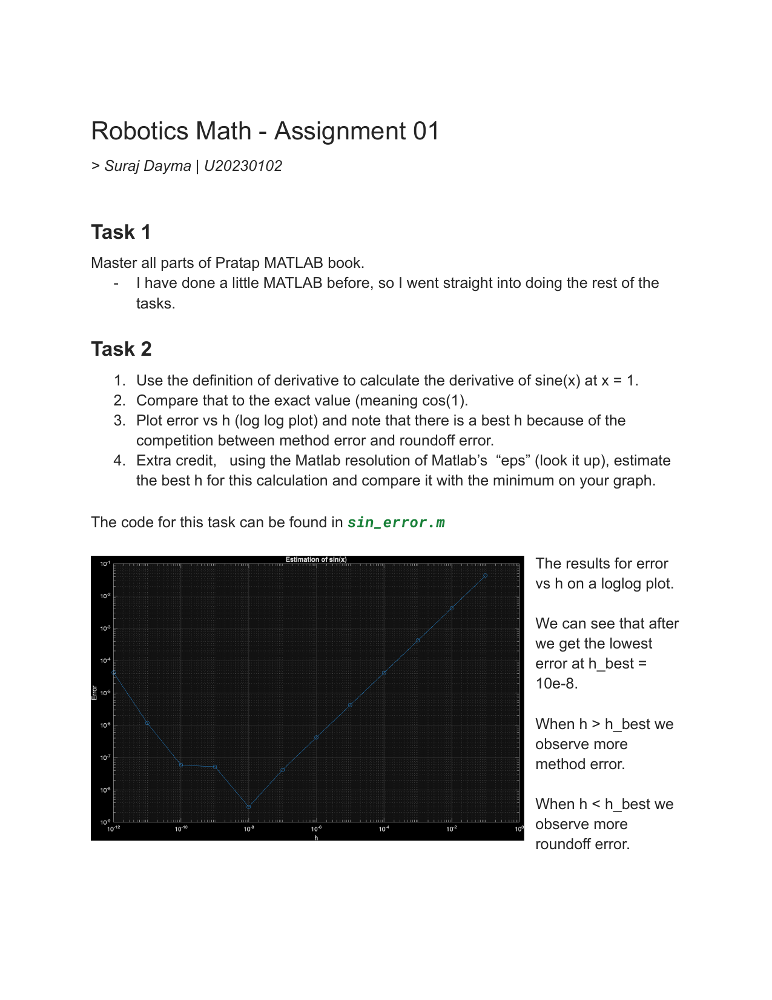
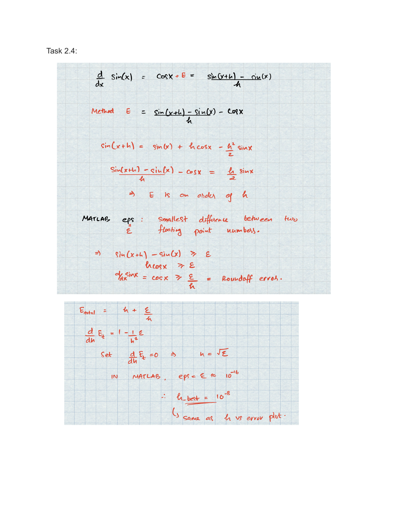
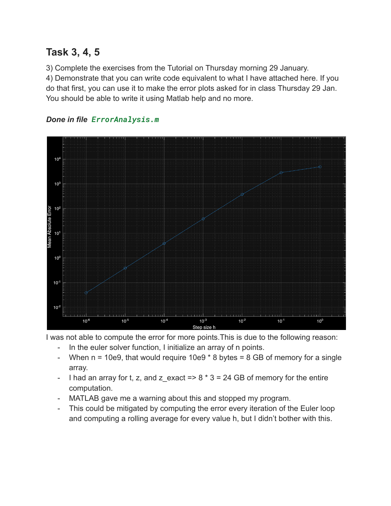
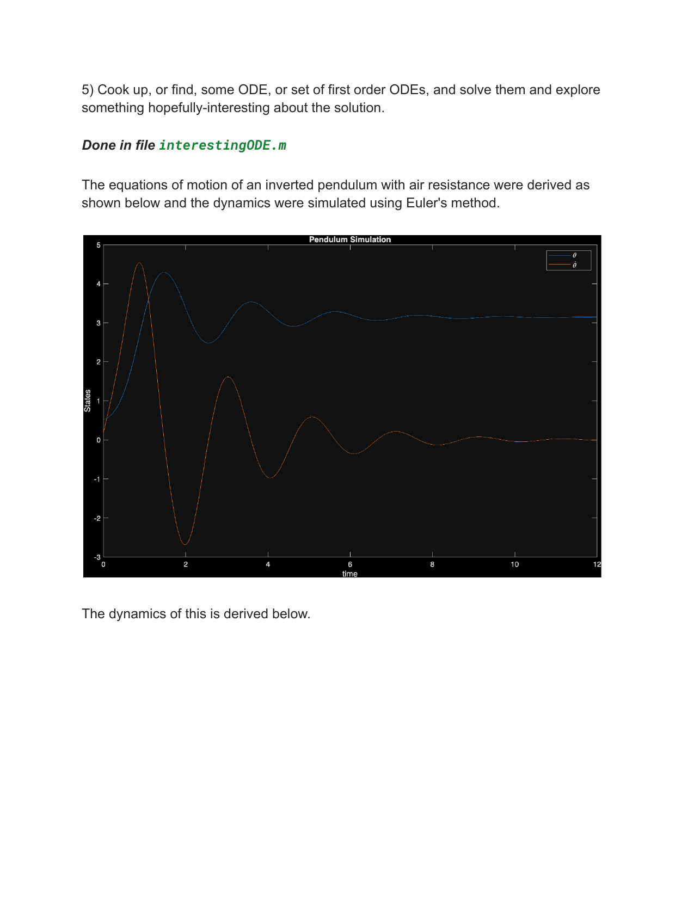
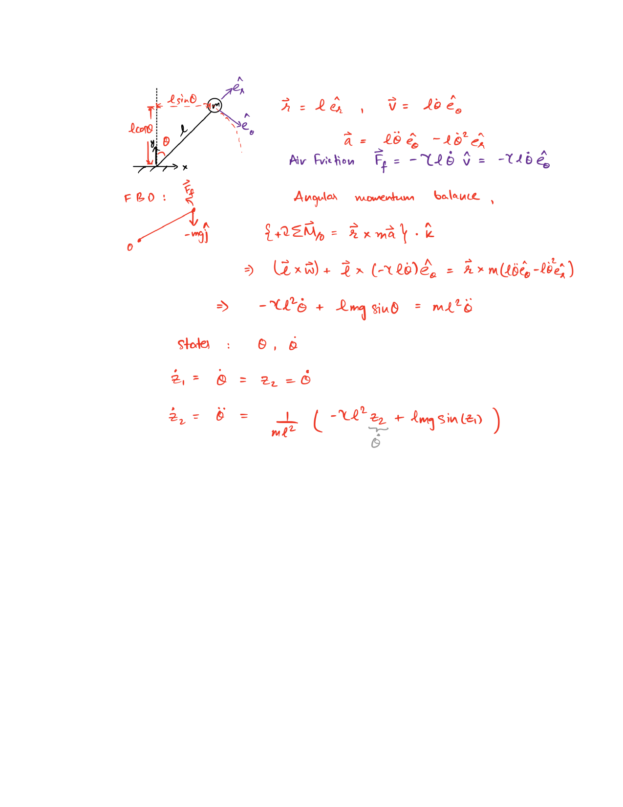

<!-- AUTO-GENERATED by tools/build_readmes.py - edit the report or tools/problems.json, then re-run. -->

# P1-5 - Numerical Differentiation and First ODEs

Derivative of sin(x) from the limit definition, the log-log error-vs-h curve and its optimal step size (method error competing with roundoff), then a first hand-written ODE integrator.

[&larr; All problems](../README.md) &middot; [Report (PDF)](01-05_ODEs.pdf)

## Code

| File | What it does |
| --- | --- |
| [`ErrorAnalysis.m`](ErrorAnalysis.m) | Euler Method to Solve an ODE |
| [`interestingODE.m`](interestingODE.m) | An inverted pendulum with air resistance, integrated with hand-written Euler. |
| [`sin_error.m`](sin_error.m) | How accurate is the numerical sin function. |

## Report

