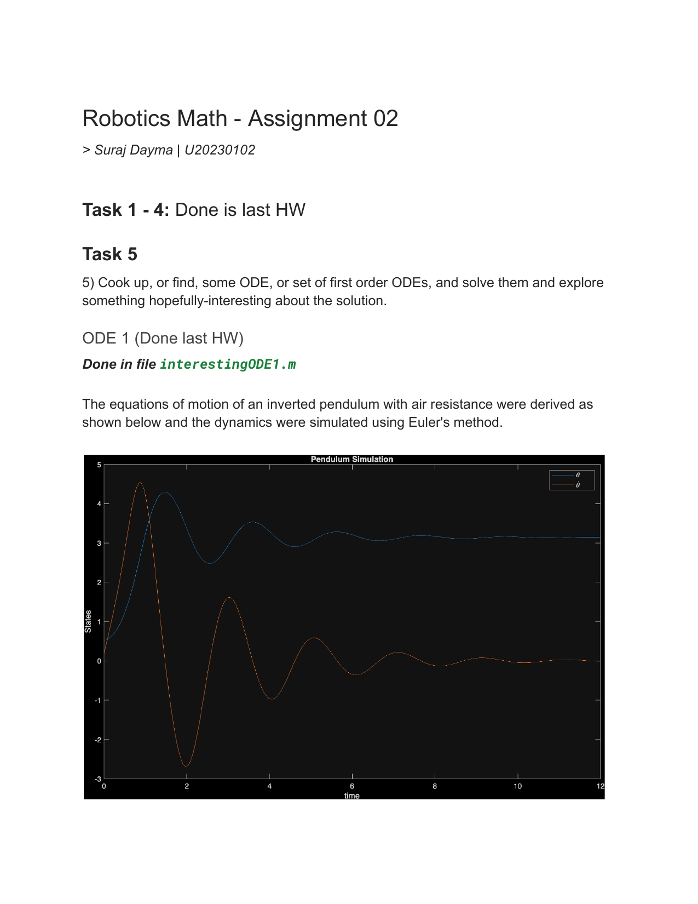
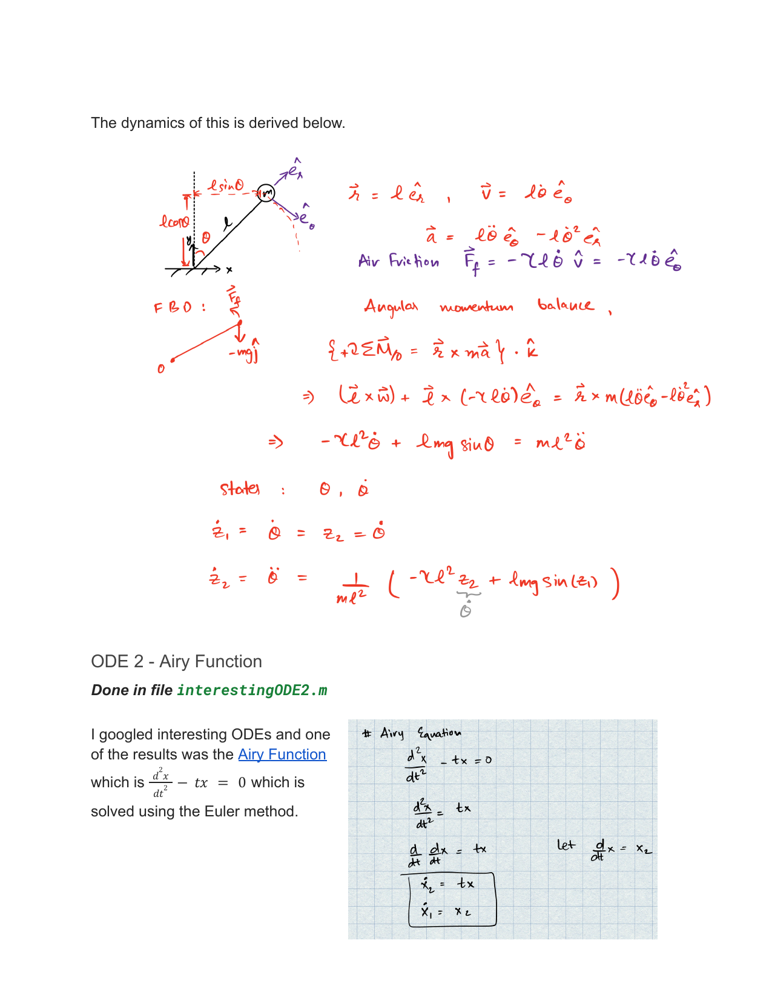
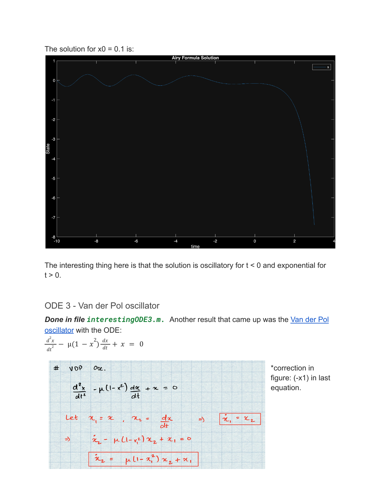
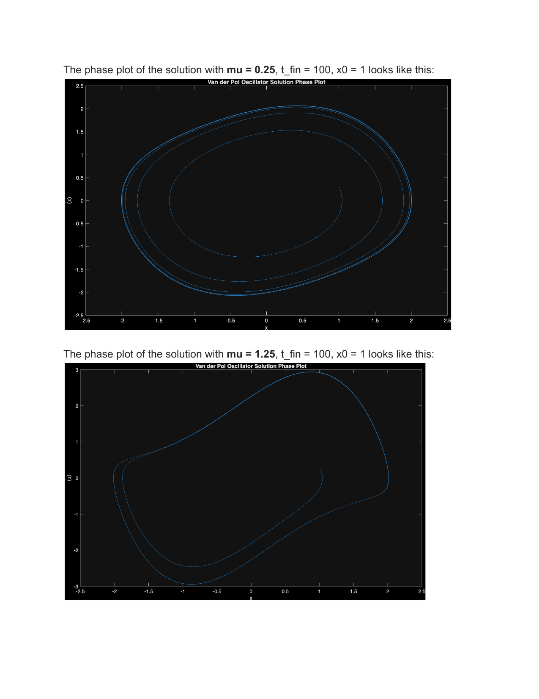
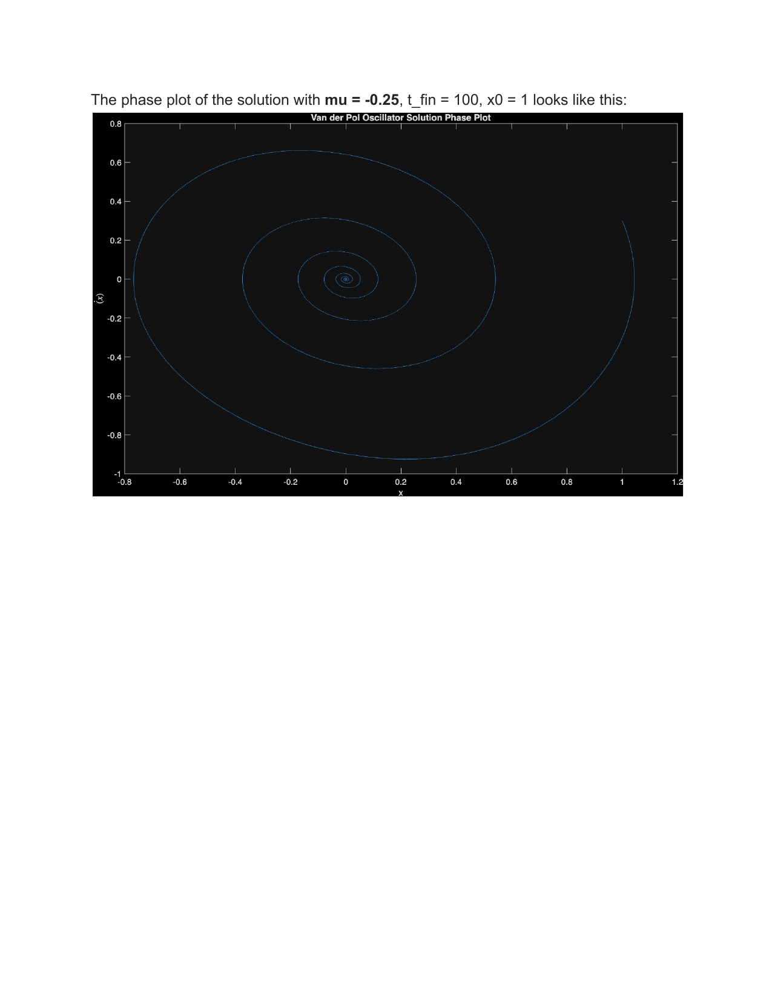
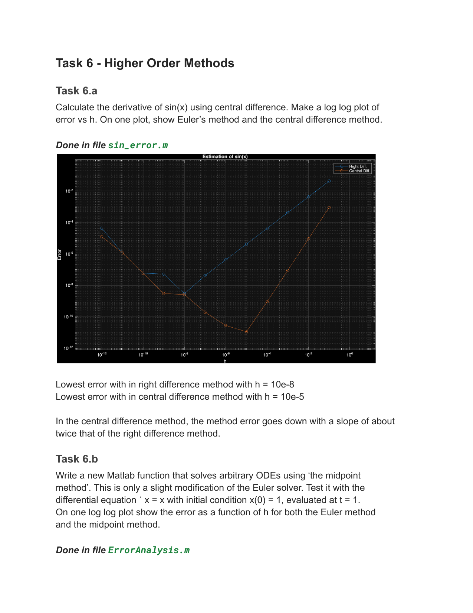
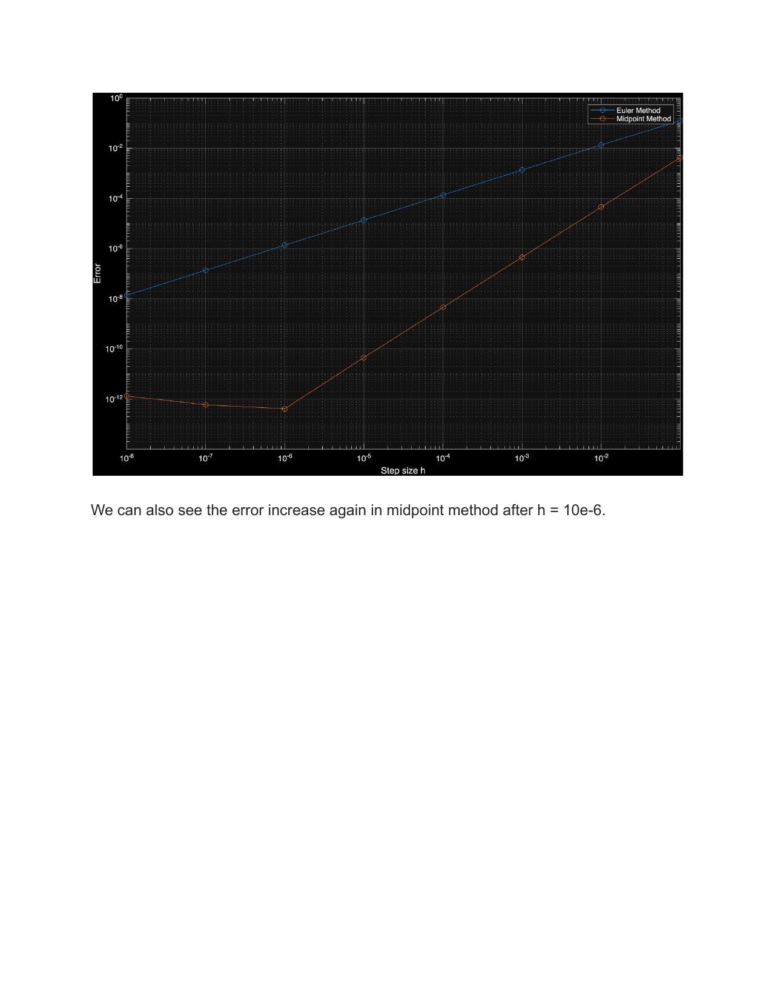
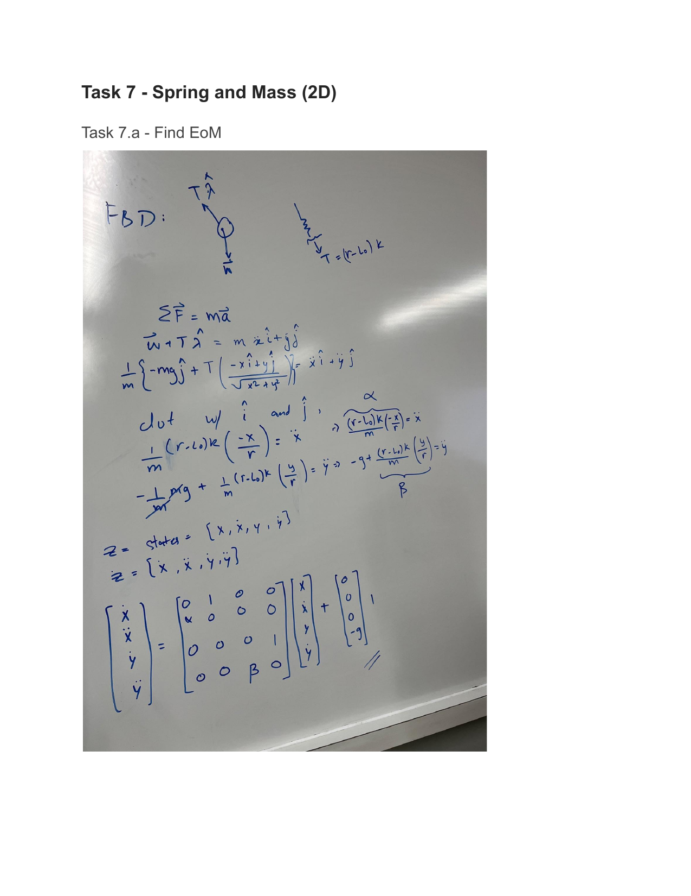

<!-- AUTO-GENERATED by tools/build_readmes.py - edit the report or tools/problems.json, then re-run. -->

# P5-7 - Interesting ODEs and Error Analysis

A handful of self-chosen ODEs solved with Euler's method - an inverted pendulum with air resistance, the Airy equation - alongside the accompanying error analysis.

[&larr; All problems](../README.md) &middot; [Report (PDF)](RMath-ASG02.pdf)

## Code

| File | What it does |
| --- | --- |
| [`ErrorAnalysis.m`](ErrorAnalysis.m) | Euler Method to Solve an ODE |
| [`interestingODE1.m`](interestingODE1.m) | See states for a damped pendulum. |
| [`interestingODE2.m`](interestingODE2.m) | See the solution of the Airy Function Ref: https://en.wikipedia.org/wiki/Airy_function ODE: ddot{x} = tx |
| [`interestingODE3.m`](interestingODE3.m) | See the solution of the Van der Pol oscillator Ref: https://en.wikipedia.org/wiki/Van_der_Pol_oscillator |
| [`sin_error.m`](sin_error.m) | How accurate is the numerical sin function. |
| [`SpringMass.m`](SpringMass.m) | Planar spring-mass system integrated with ode45. |

## Report

