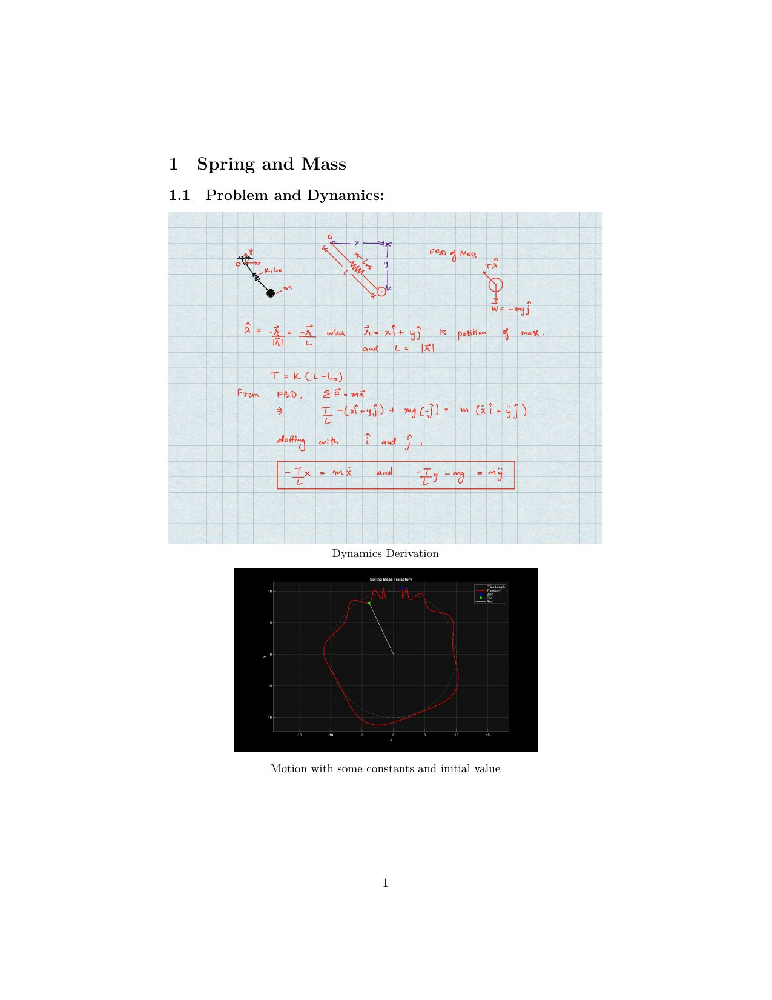
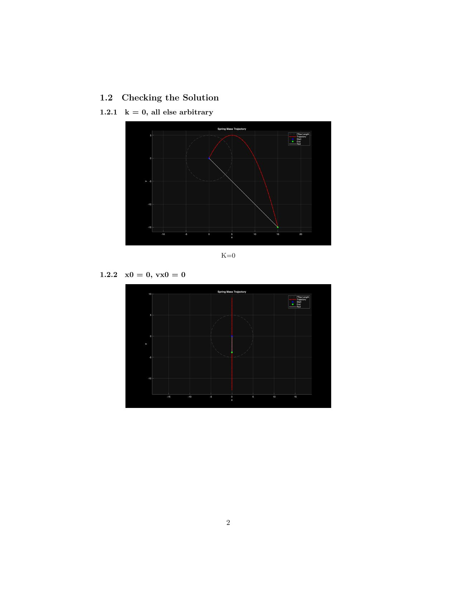
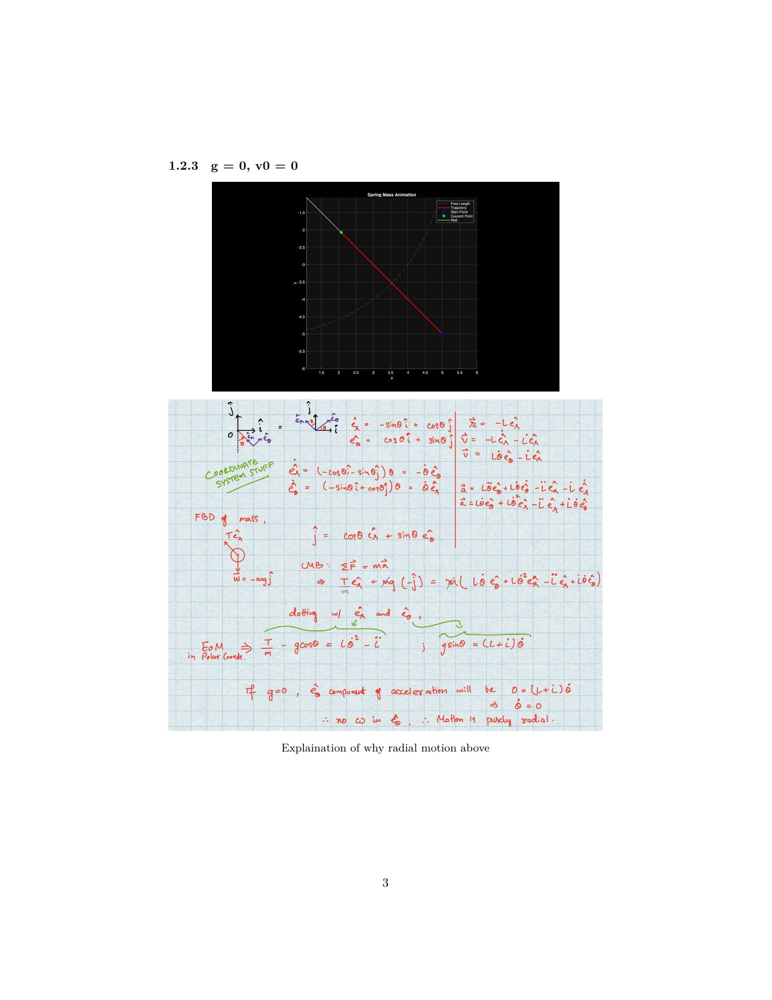
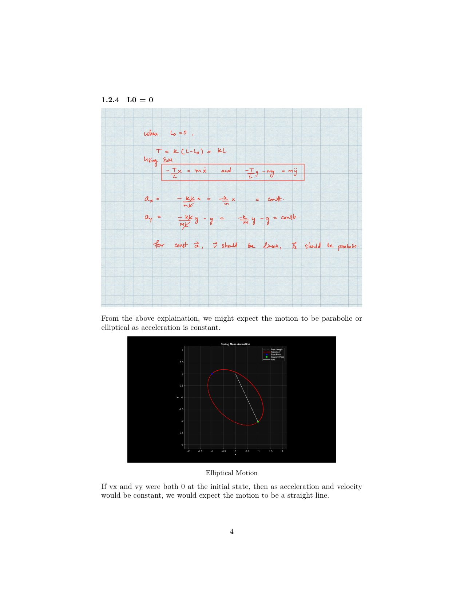
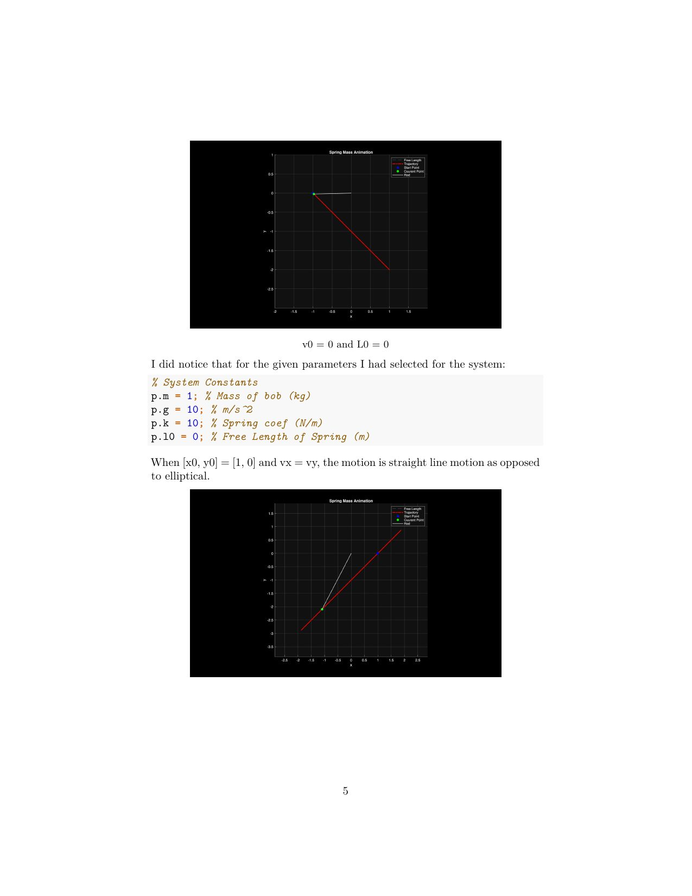

<!-- AUTO-GENERATED by tools/build_readmes.py - edit the report or tools/problems.json, then re-run. -->

# P7 - Spring and Mass

Planar mass on a zero-length-capable spring under gravity. Dynamics derived by hand, then simulated and sanity-checked against limiting cases (k = 0 gives projectile flight, l0 = 0 gives elliptical orbits, and so on).

[&larr; All problems](../README.md) &middot; [Report (PDF)](07_SpringandMass.pdf) &middot; [Markdown source](07_SpringandMass.md)

## Code

| File | What it does |
| --- | --- |
| [`myRHS.m`](myRHS.m) | `zdot = myRHS(t,z,p)` |
| [`SpringMass.m`](SpringMass.m) | **Entry point.** See trajectory and animation for a 2D spring mass system |

## Report

