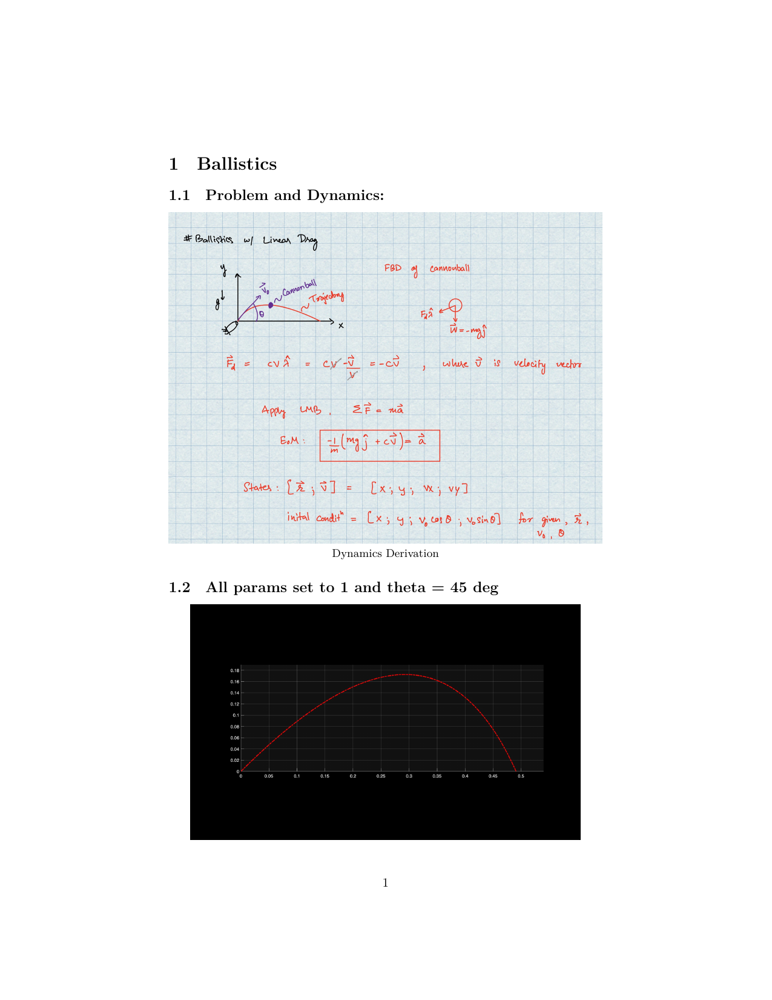
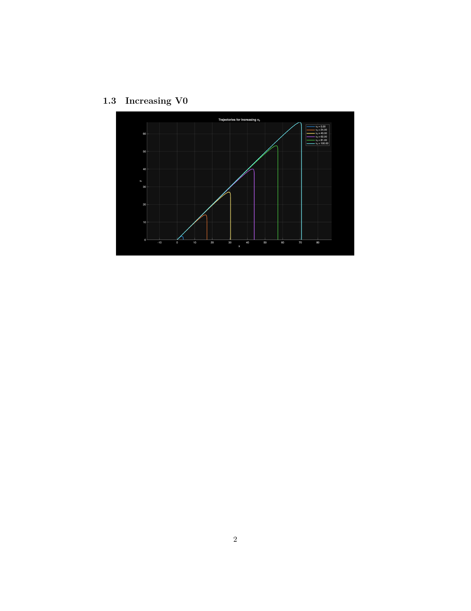

<!-- AUTO-GENERATED by tools/build_readmes.py - edit the report or tools/problems.json, then re-run. -->

# P8 - Ballistics

Projectile flight integrated with ode45 and an event function that stops the solver at ground impact, plus a sweep over launch speed and launch angle.

[&larr; All problems](../README.md) &middot; [Report (PDF)](08_ballistics.pdf) &middot; [Markdown source](08_ballistics.md)

## Code

| File | What it does |
| --- | --- |
| [`ballistics.m`](ballistics.m) | **Entry point.** Single ballistic trajectory with all parameters set to 1 and a 45 degree launch. |
| [`best_theta.m`](best_theta.m) | Sweeps the launch angle to find the one that maximises range. |
| [`increasing_v0.m`](increasing_v0.m) | Sweeps launch speed and overlays the resulting trajectories. |
| [`myEvent.m`](myEvent.m) | `[value, isterminal, direction] = myEvent(t, z)` |
| [`myRHS.m`](myRHS.m) | `zdot = myRHS(t,z,p)` |

## Report

