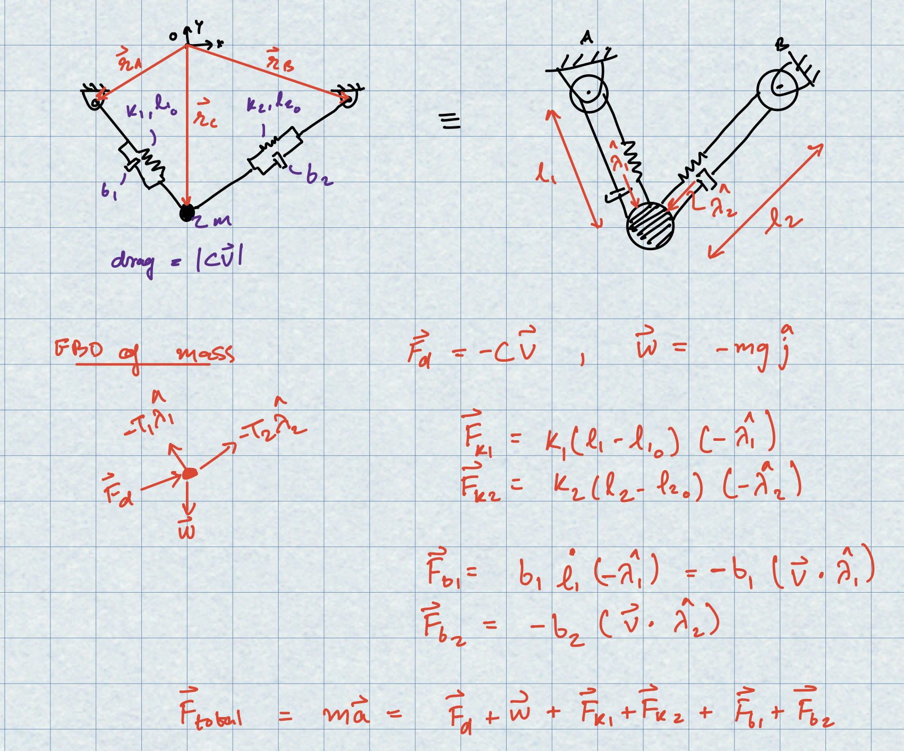

<!-- AUTO-GENERATED by tools/build_readmes.py - edit the report or tools/problems.json, then re-run. -->

# P9 - Two Springs, Two Dampers - Fixed Points

Force balance for a mass held by two springs and two dampers, and a first numerical hunt for the equilibria of that system.

[&larr; All problems](../README.md) &middot; [Markdown source](info.md)

## Code

| File | What it does |
| --- | --- |
| [`fixedPoints.m`](fixedPoints.m) | Solves the force balance for the equilibria of the two-spring/two-damper mass. |
| [`myRHS.m`](myRHS.m) | `zdot = myRHS(t,z,p)` |
| [`TwoSpringAndMass.m`](TwoSpringAndMass.m) | **Entry point.** See trajectory and animation for a 2D spring mass system |

## Report

### Spring Dampers

#### Problem and Dynamics:

 <i>Force Balance</i>

#### Fixed Points
