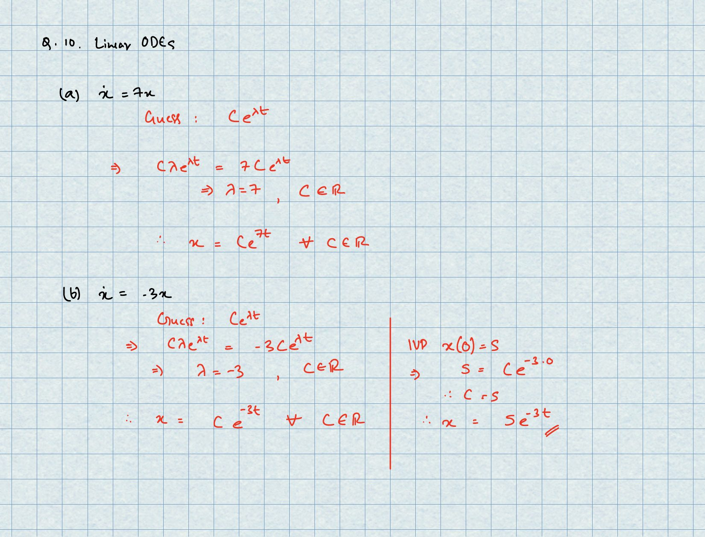
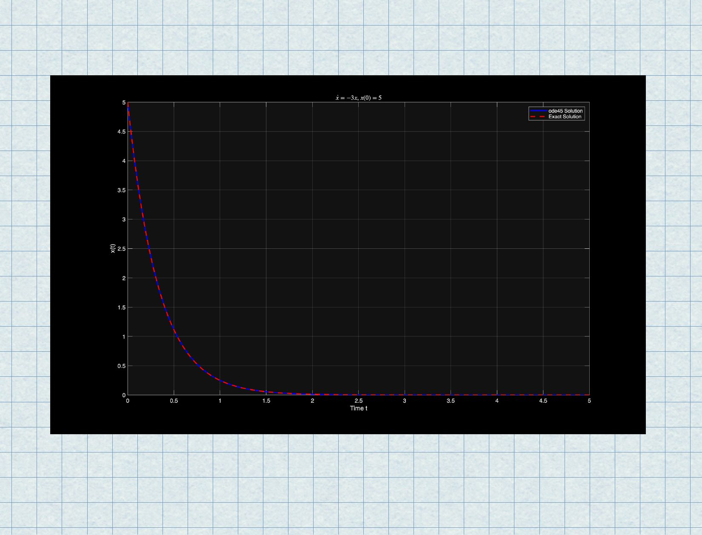
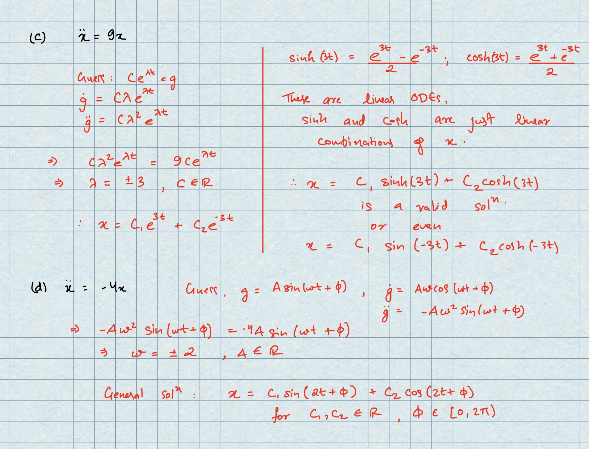
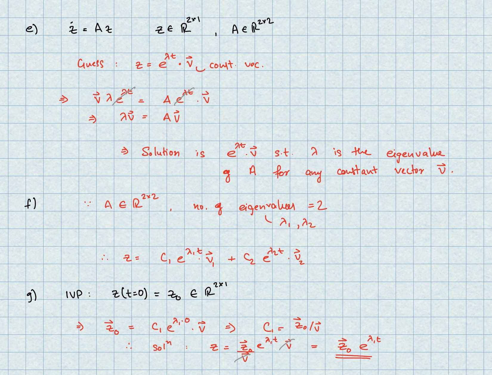
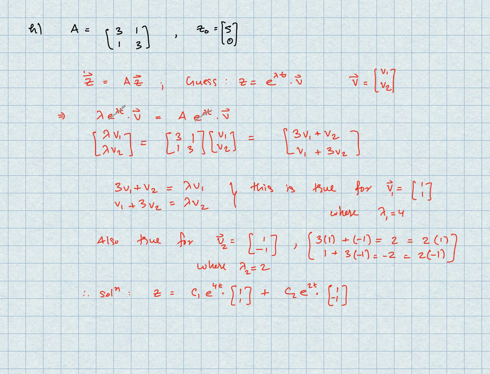
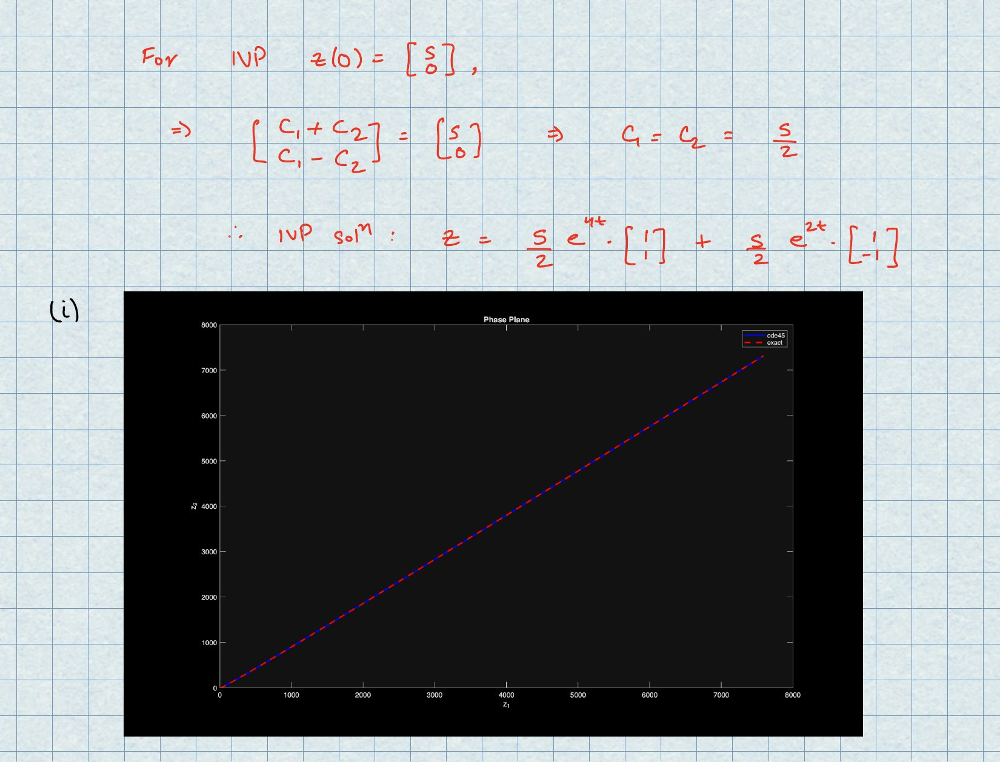
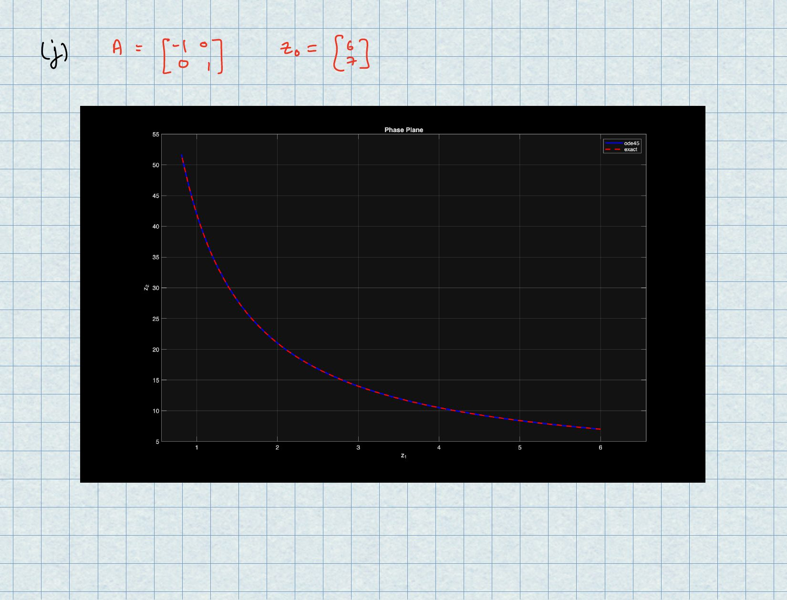

<!-- AUTO-GENERATED by tools/build_readmes.py - edit the report or tools/problems.json, then re-run. -->

# P10 - Linear ODEs and Matrix Exponentials

Solving zdot = Az by hand via eigenvalues and eigenvectors, then checking the analytic solution against a numerical one. Report is handwritten and scanned.

[&larr; All problems](../README.md) &middot; [Report (PDF)](10_ODEs.pdf)

## Code

| File | What it does |
| --- | --- |
| [`myzdotAz.m`](myzdotAz.m) | Same comparison for a diagonal A with one stable and one unstable direction. |
| [`solveODE.m`](solveODE.m) | **Entry point.** main.m |
| [`zdotAz.m`](zdotAz.m) | zdot = Az for a symmetric A: ode45 against the eigenvector solution. |

## Report

