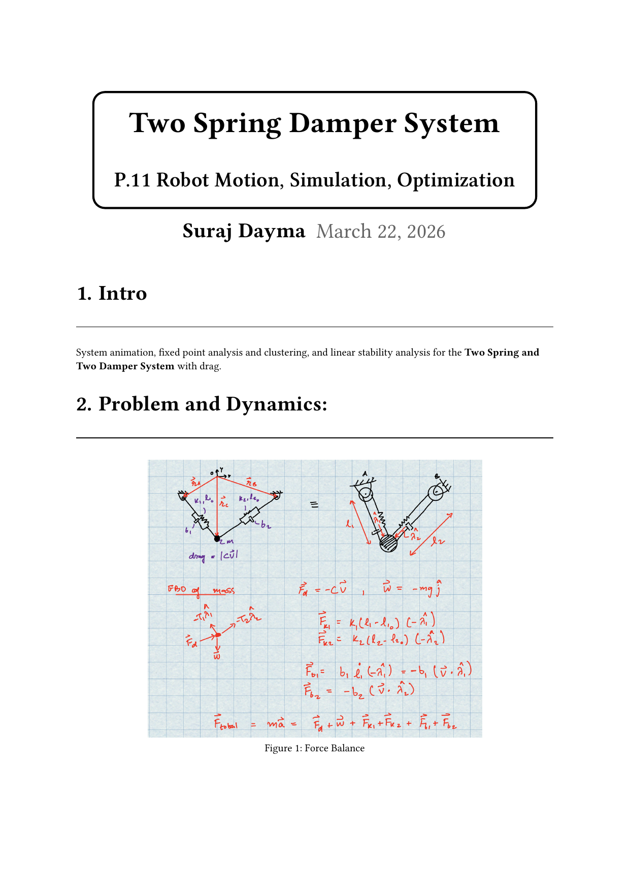
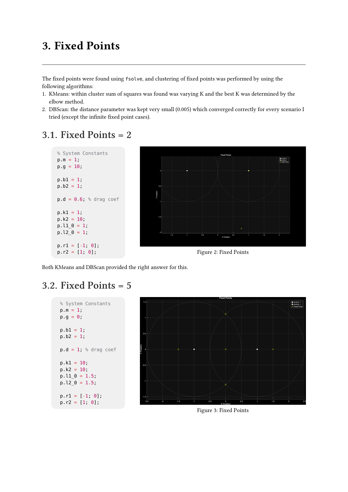
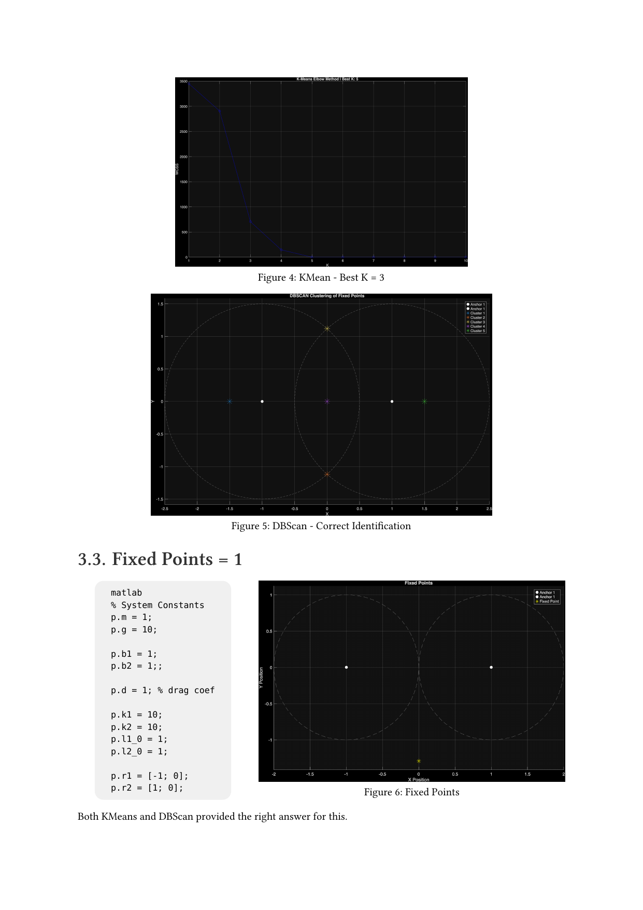
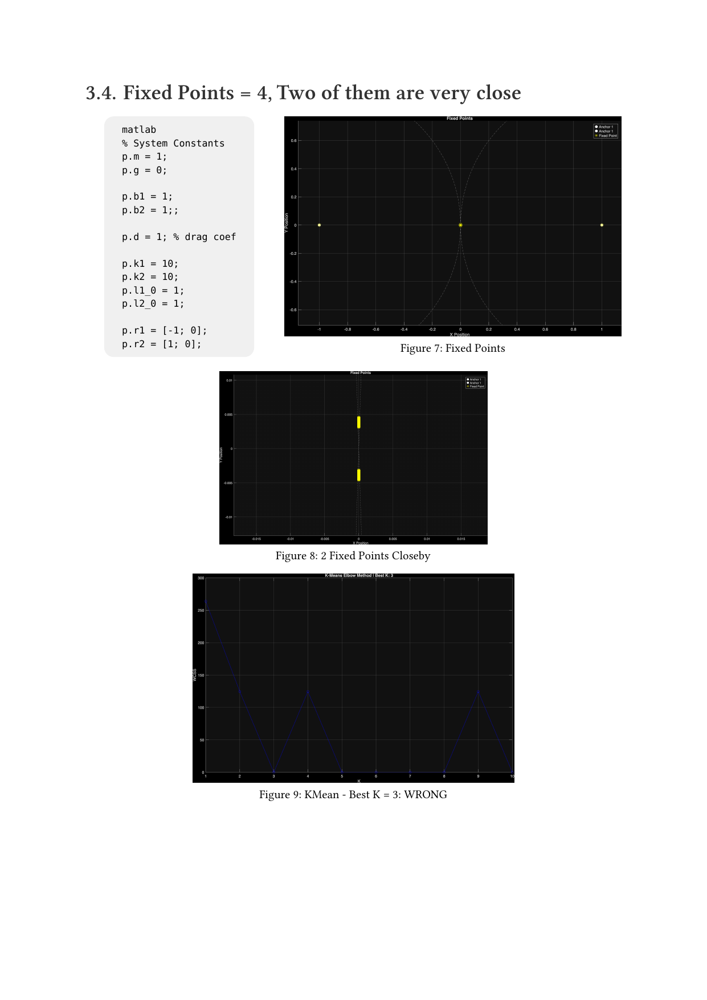
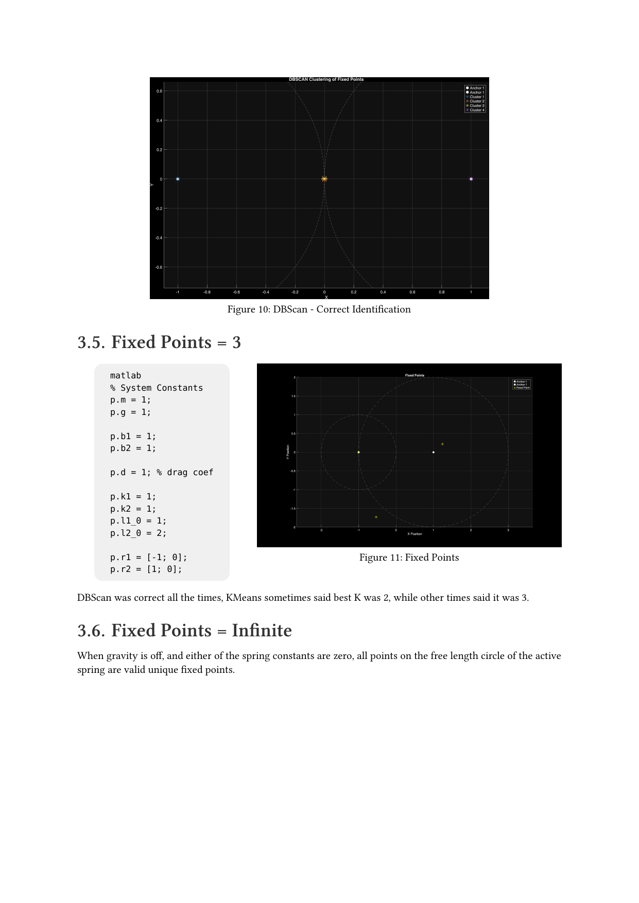
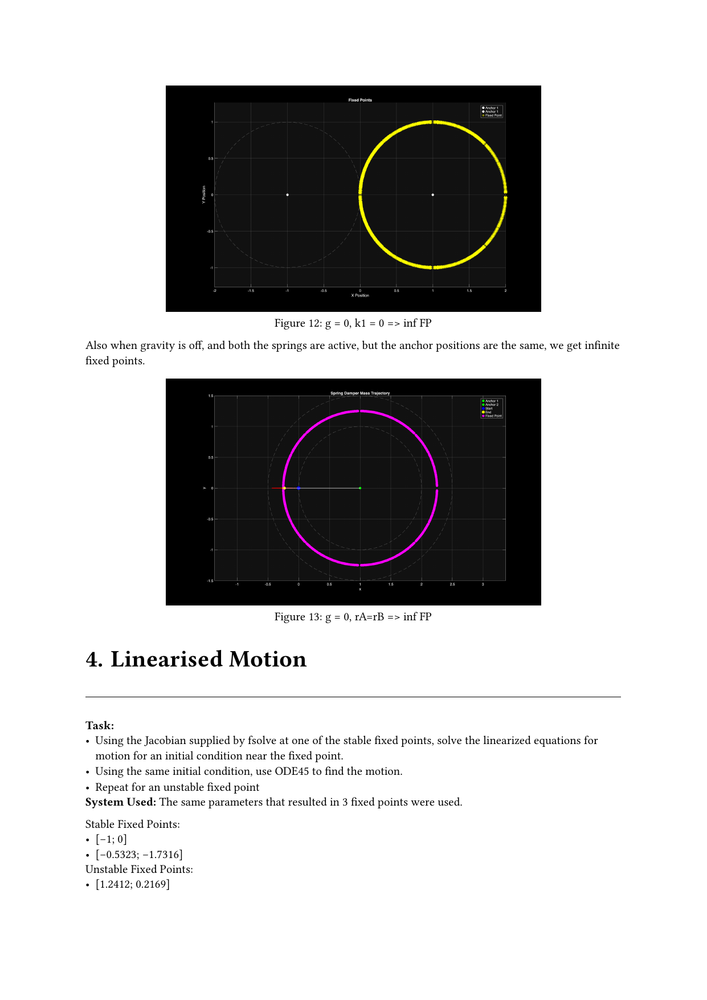
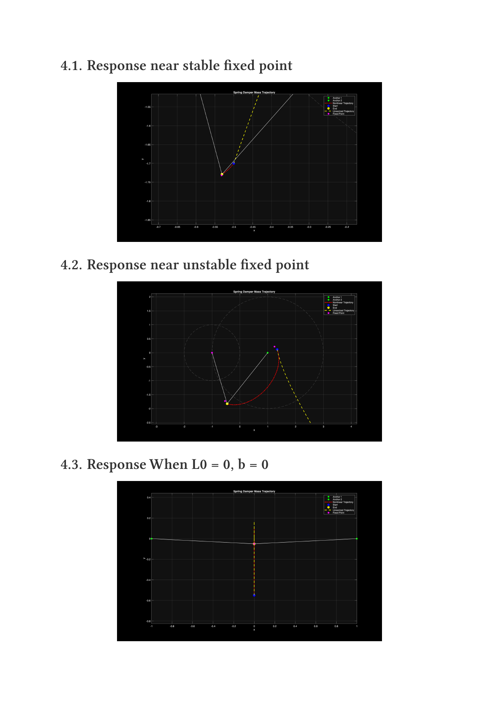
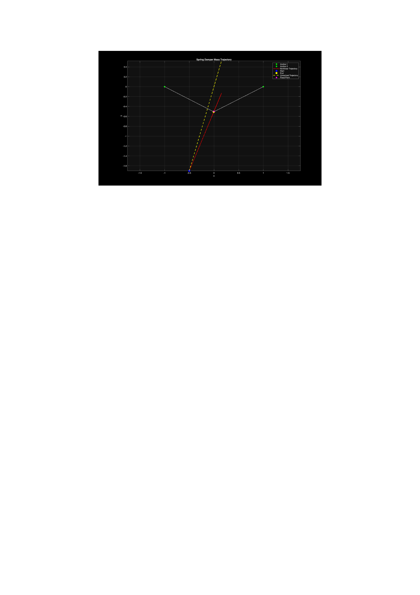
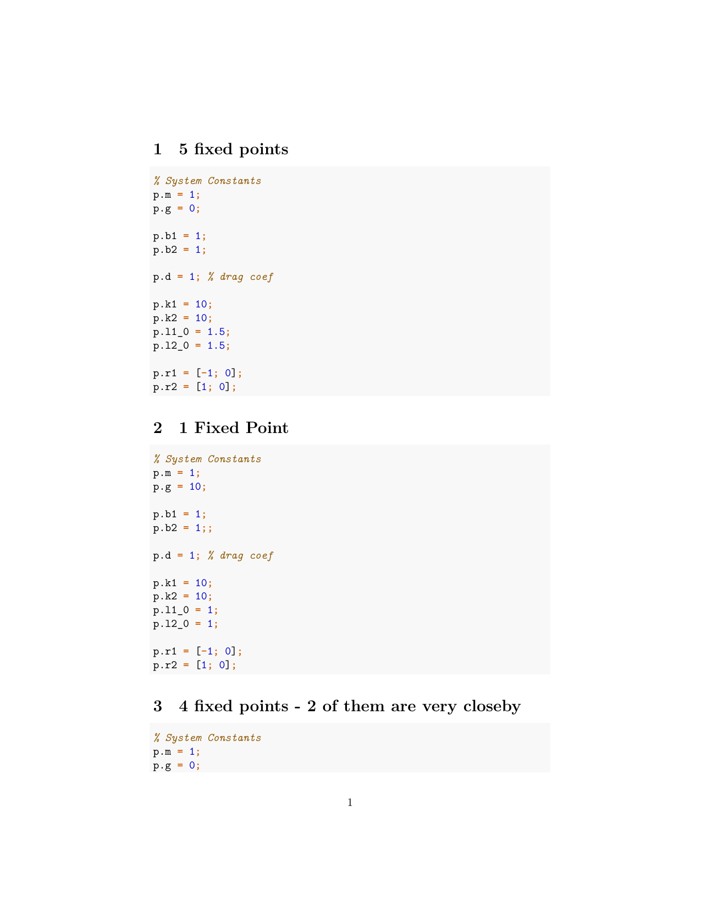
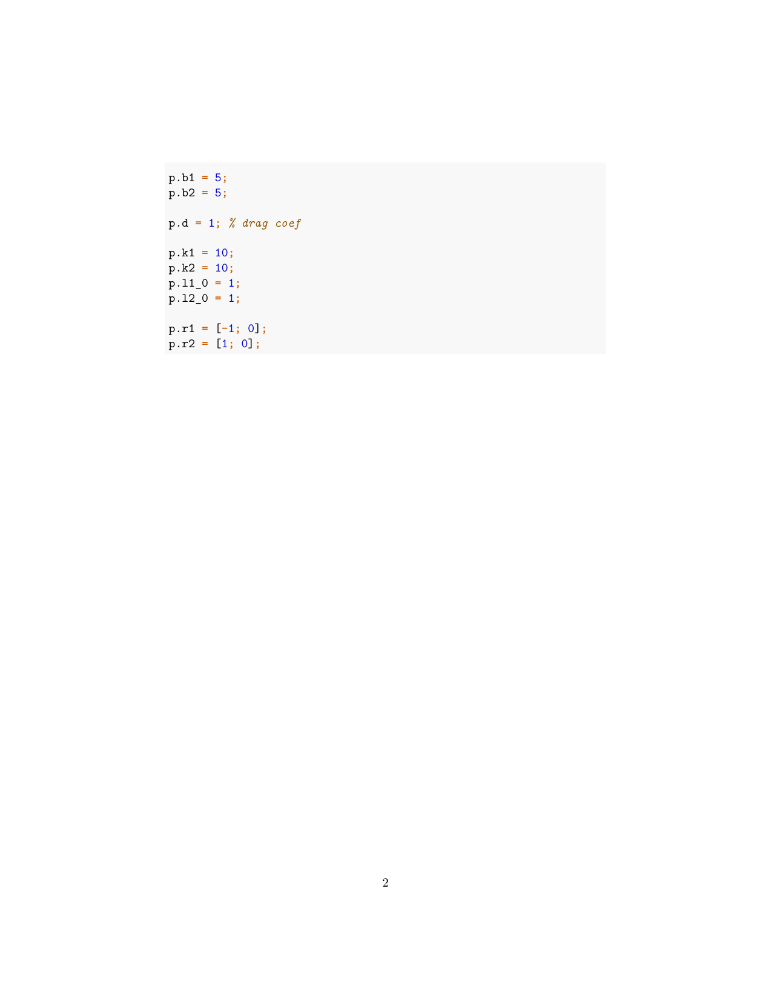

<!-- AUTO-GENERATED by tools/build_readmes.py - edit the report or tools/problems.json, then re-run. -->

# P11 - Two Spring Damper System

Full treatment of the two-spring/two-damper mass with drag: animation, a multi-start search for fixed points with k-means and DBSCAN clustering to de-duplicate them, and linear stability from the numerically perturbed Jacobian.

[&larr; All problems](../README.md) &middot; [Report (PDF)](11_SpringAndMass.pdf) &middot; [Typst source](11_SpringAndMass.typ)

## Code

| File | What it does |
| --- | --- |
| [`convertFigtoPNG.m`](convertFigtoPNG.m) | Set the folder path (current folder by default) |
| [`findFixedPoints.m`](findFixedPoints.m) | Funcntion to find fixed points and return array of unique FPs |
| [`fixedPoints.m`](fixedPoints.m) | File to see what fixed points there are and perform clustering on them to get the right number of fixed points. |
| [`linearisedResponse.m`](linearisedResponse.m) | See trajectory and animation for a 2D spring mass system |
| [`myRHS.m`](myRHS.m) | `zdot = myRHS(t,z,p)` |
| [`TwoSpringAndMass.m`](TwoSpringAndMass.m) | **Entry point.** See trajectory and animation for a 2D spring mass system |

## Report

## Supplementary

### params

