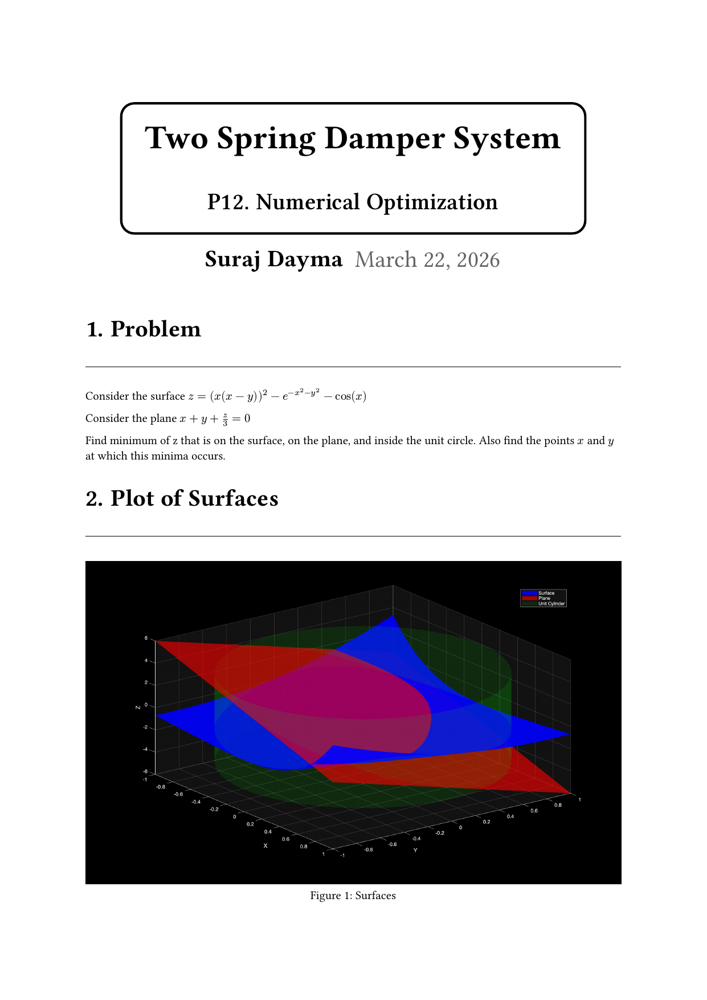
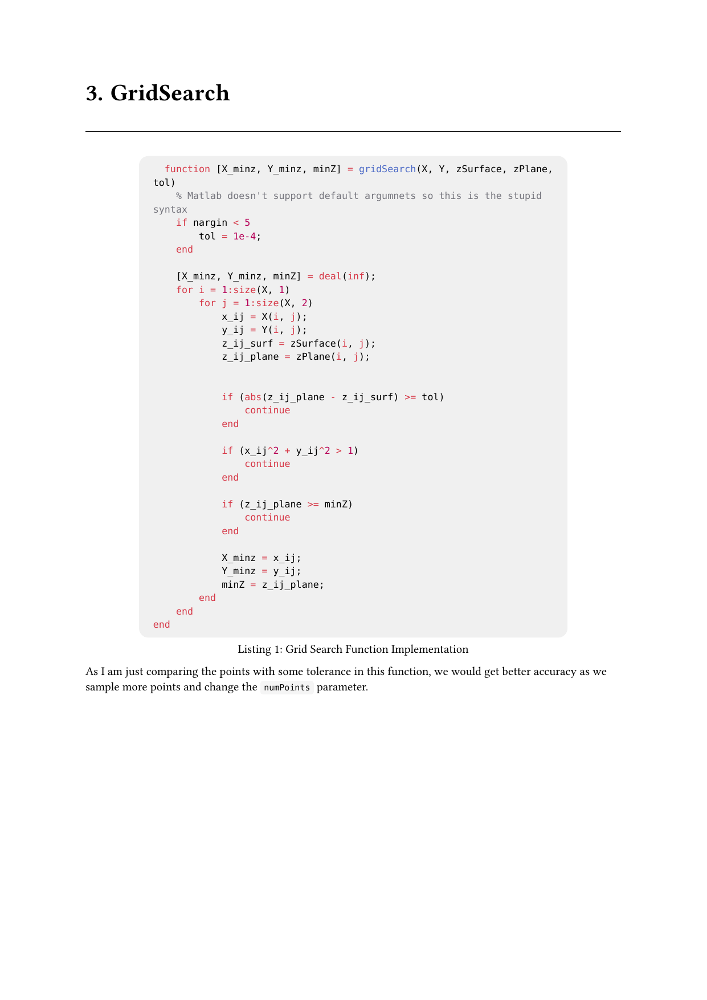
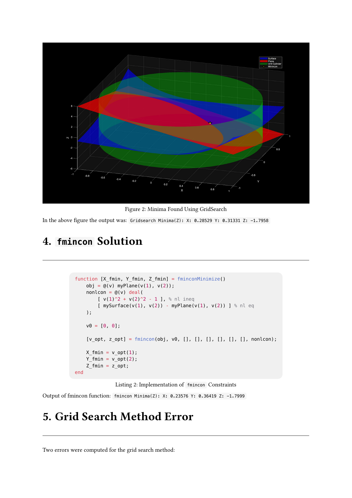
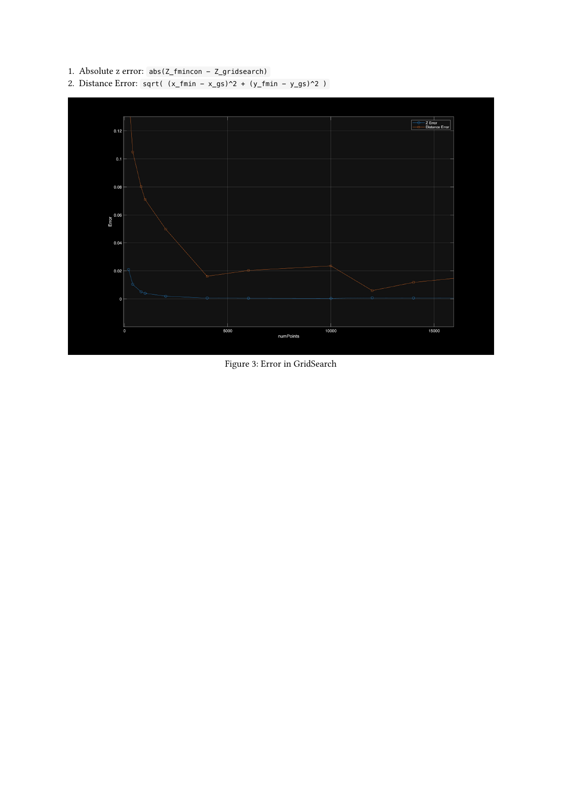

<!-- AUTO-GENERATED by tools/build_readmes.py - edit the report or tools/problems.json, then re-run. -->

# P12 - Numerical Optimization

Minimising z = (x(x-y))^2 - exp(-x^2-y^2) - cos(x): grid search for the basins, gradient-free refinement, and how the answer converges as the grid is refined.

[&larr; All problems](../README.md) &middot; [Report (PDF)](12_NumericalOptimization.pdf) &middot; [Typst source](12_NumericalOptimization.typ)

## Code

| File | What it does |
| --- | --- |
| [`numOpt.m`](numOpt.m) | **Entry point.** Grid-searches the surface for its minimum, then refines with fmincon. |
| [`numPointsVsError.m`](numPointsVsError.m) | Sweeps the grid resolution and plots how the grid-search error decays. |

## Report

