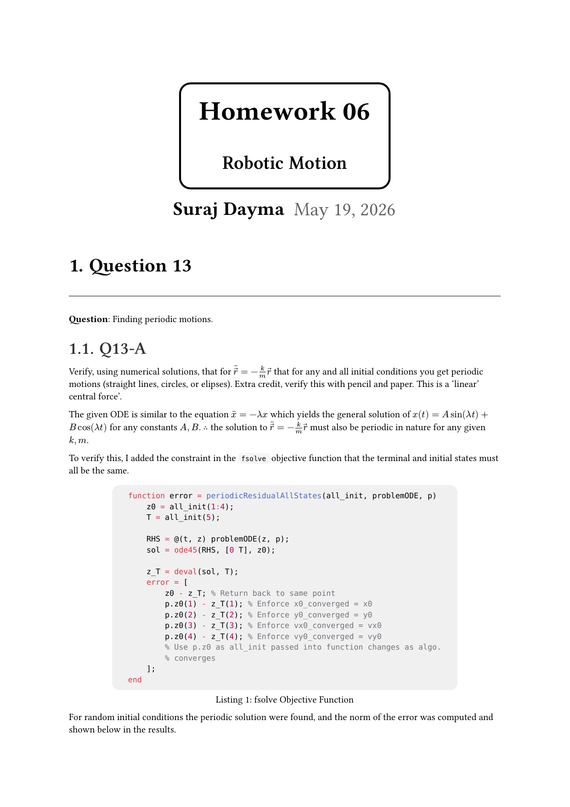
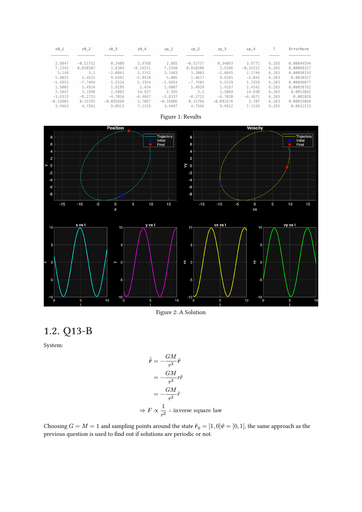
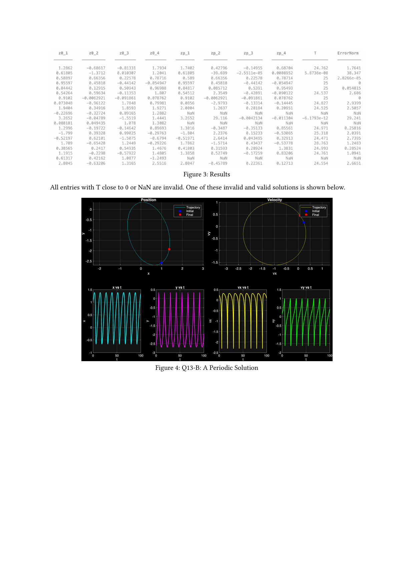
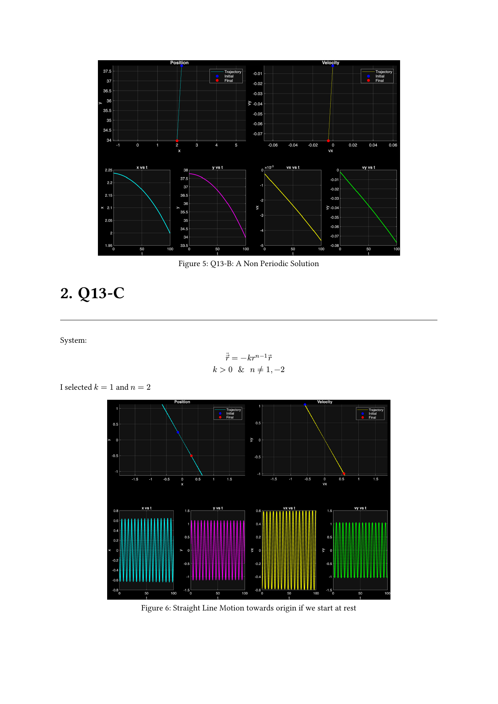
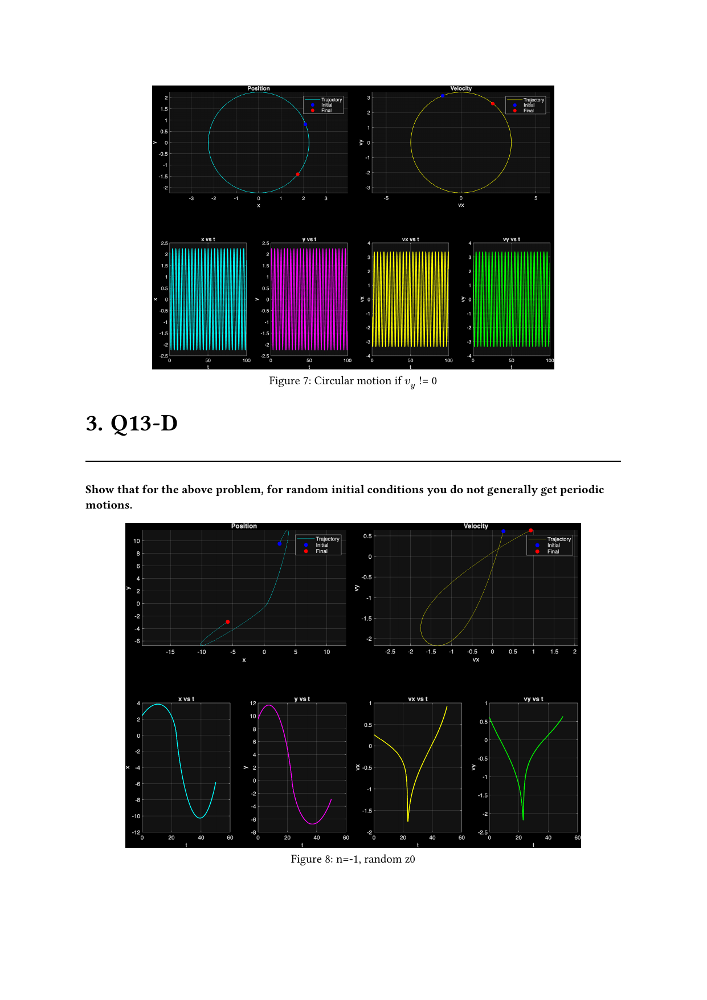
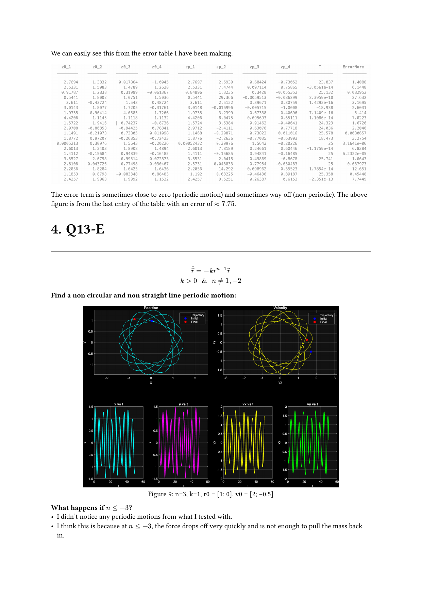

<!-- AUTO-GENERATED by tools/build_readmes.py - edit the report or tools/problems.json, then re-run. -->

# P13-14 - Periodic Solutions

Finding periodic motions by root-finding on the map from an initial state back to itself after one period, and classifying what is genuinely periodic versus pseudo-periodic. Includes the instructor's reference solution for comparison.

[&larr; All problems](../README.md) &middot; [Report (PDF)](main.pdf) &middot; [Typst source](main.typ)

## Code

| File | What it does |
| --- | --- |
| [`findFixedPoints.m`](findFixedPoints.m) | Locates the system's equilibria, used as seeds for the periodic search. |
| [`PeriodicMotion.m`](PeriodicMotion.m) | **Entry point.** Root-finds initial conditions that return to themselves after one period. |

Also in this folder:

- [`andySolution/`](andySolution)

## Report

