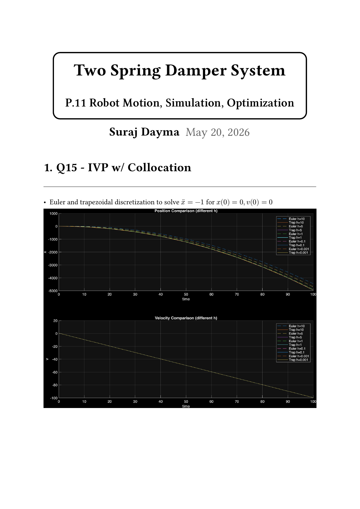
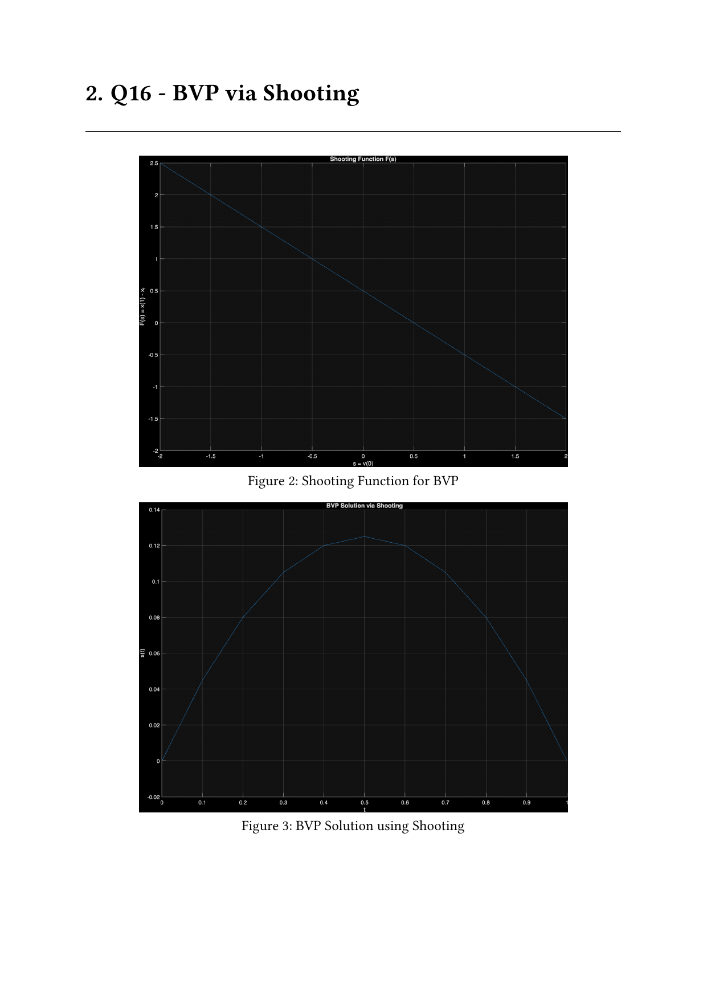
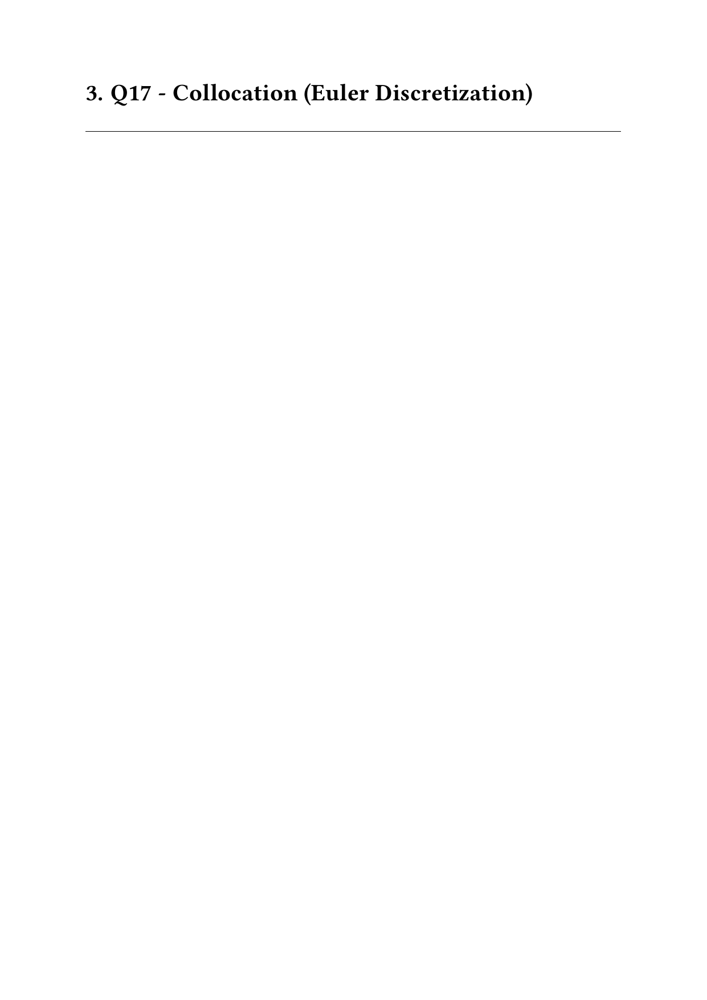
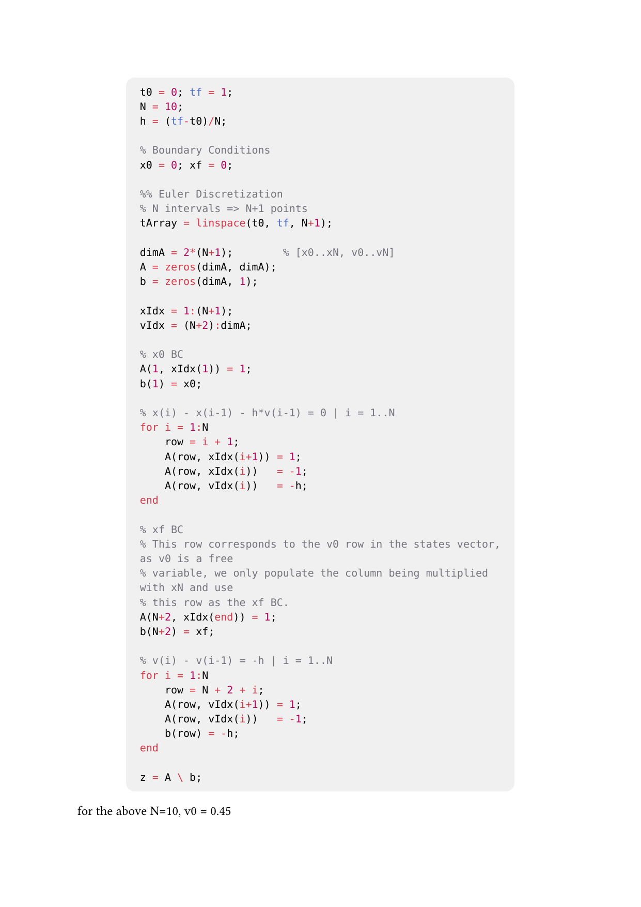

<!-- AUTO-GENERATED by tools/build_readmes.py - edit the report or tools/problems.json, then re-run. -->

# P15-17 - Shooting and Collocation

Three ways to hit a boundary condition: an IVP solved with trapezoidal collocation, a boundary value problem solved by shooting, and the same BVP solved by collocation.

[&larr; All problems](../README.md) &middot; [Report (PDF)](main.pdf) &middot; [Typst source](main.typ)

## Code

| File | What it does |
| --- | --- |
| [`Q15_Trapezoidal.m`](Q15_Trapezoidal.m) | Initial Value Problem (IVP) with collocation. |
| [`Q16_Shooting.m`](Q16_Shooting.m) | Boundary Value Problem via Shooting |
| [`Q17_Colloc.m`](Q17_Colloc.m) | Q17 - the same boundary value problem solved by trapezoidal collocation. |

## Report

