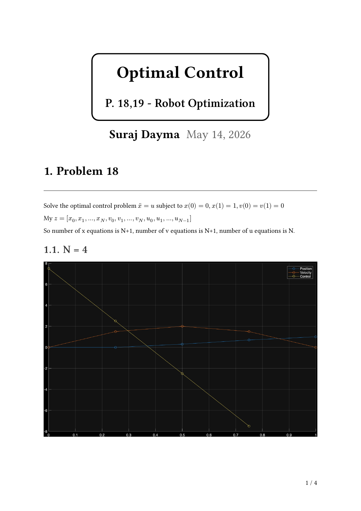
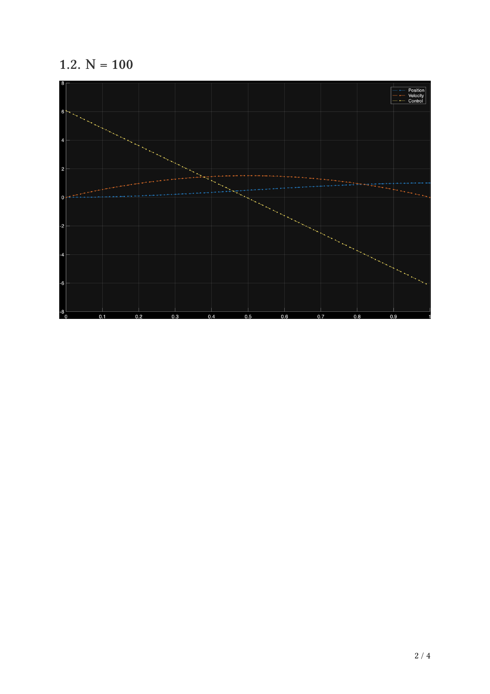
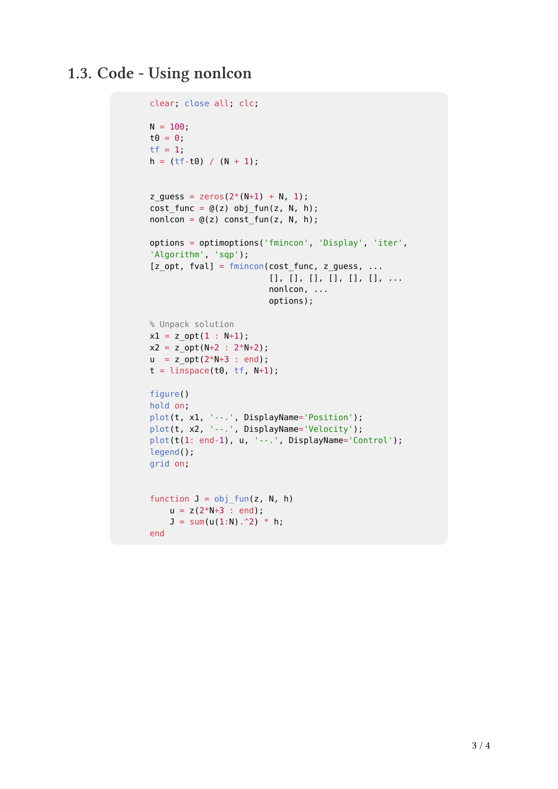
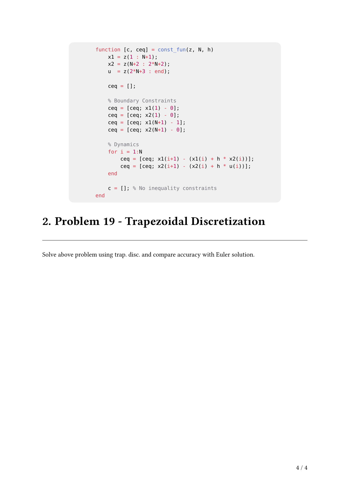

<!-- AUTO-GENERATED by tools/build_readmes.py - edit the report or tools/problems.json, then re-run. -->

# P18-19 - Optimal Control

Minimum-effort control of xddot = u between fixed boundary states, discretised by collocation and handed to fmincon, plus how the solution error scales as the number of collocation points grows.

[&larr; All problems](../README.md) &middot; [Report (PDF)](18-19_OptimalControl.pdf) &middot; [Typst source](18-19_OptimalControl.typ)

## Code

| File | What it does |
| --- | --- |
| [`OptimalControl.m`](OptimalControl.m) | **Entry point.** Trapezoidal collocation of xddot = u, minimised with fmincon, plus the error-vs-N study. |

## Report

