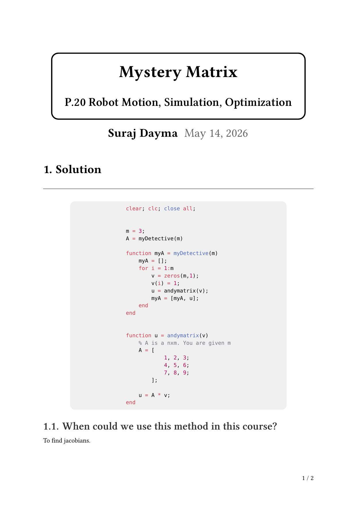
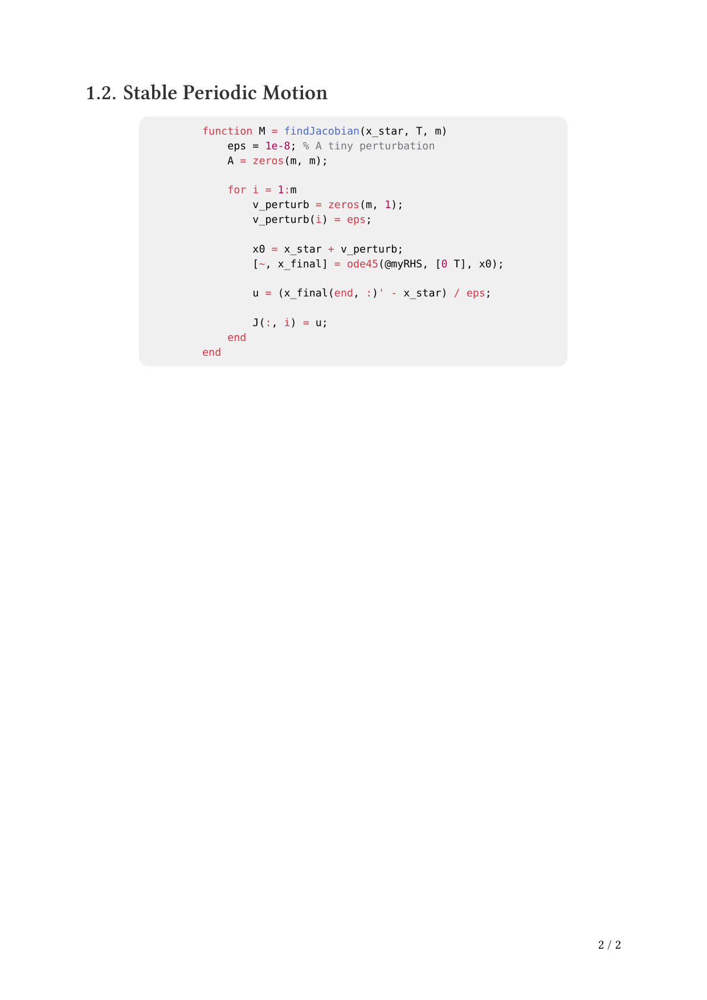

<!-- AUTO-GENERATED by tools/build_readmes.py - edit the report or tools/problems.json, then re-run. -->

# P20 - Mystery Matrix

Recovering an unknown matrix from its action on probe vectors.

[&larr; All problems](../README.md) &middot; [Report (PDF)](MysteryMatrix.pdf) &middot; [Typst source](MysteryMatrix.typ)

## Code

| File | What it does |
| --- | --- |
| [`MysteryMatrix.m`](MysteryMatrix.m) | **Entry point.** Probes the hidden matrix one basis vector at a time to reconstruct it column by column. |

## Report

