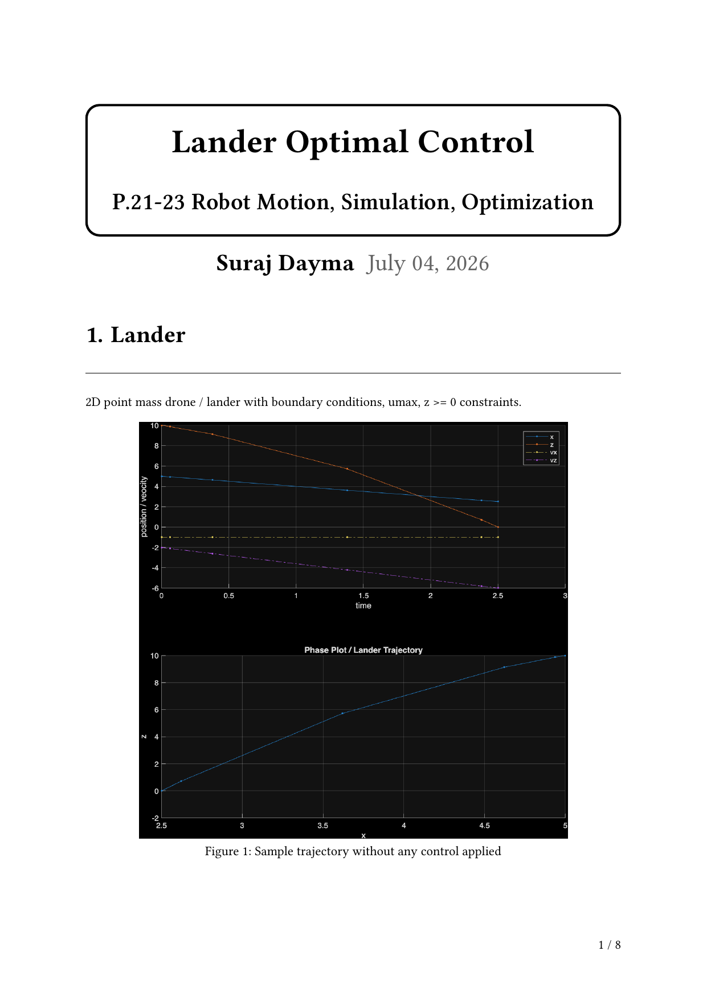
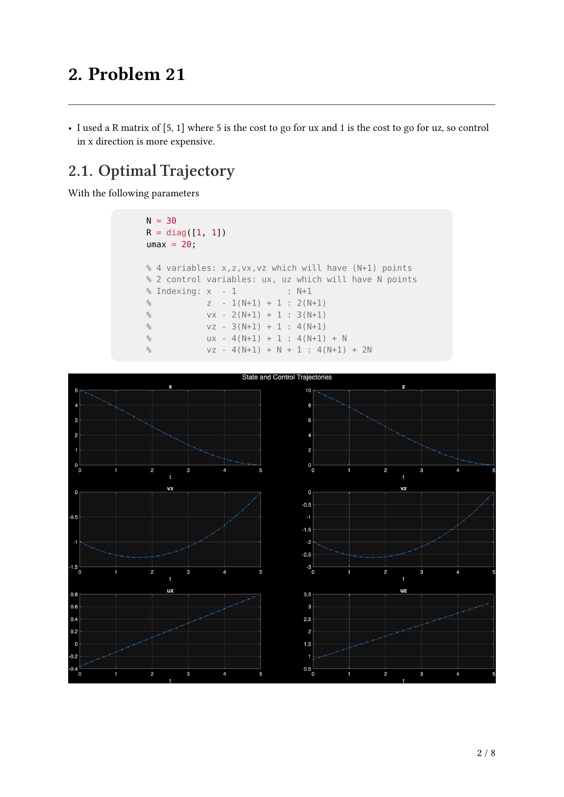
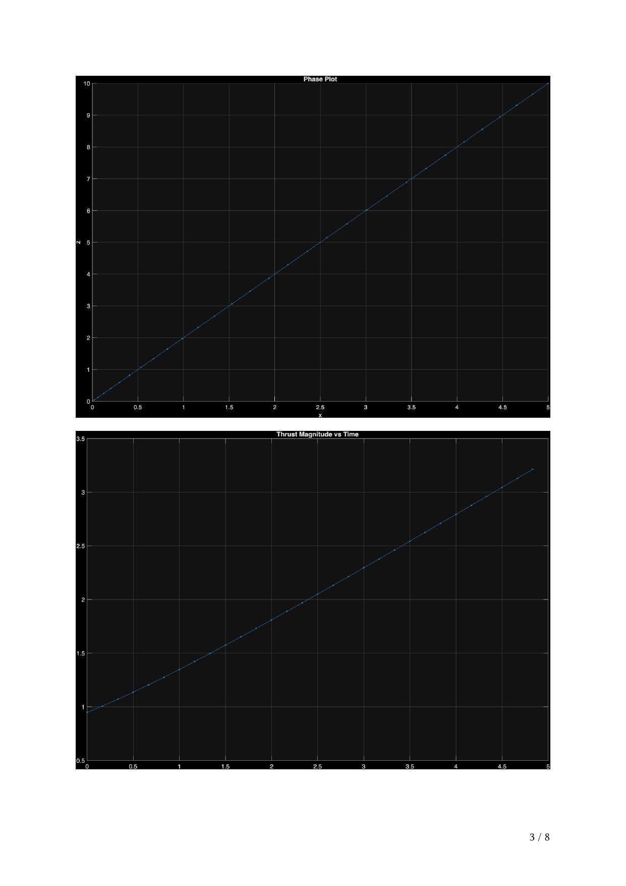
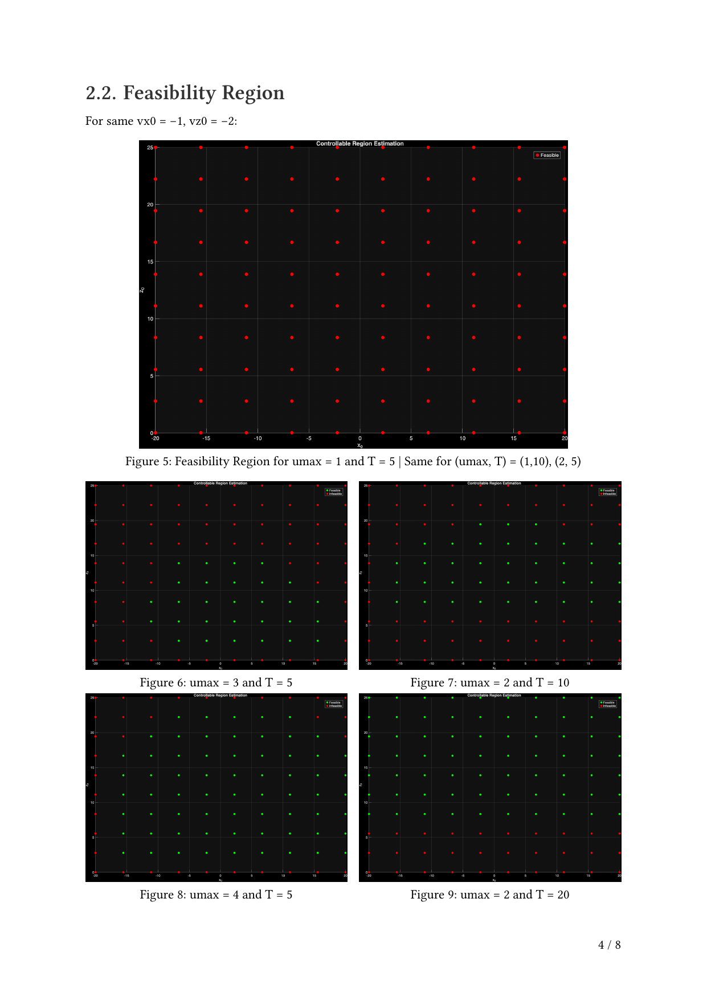
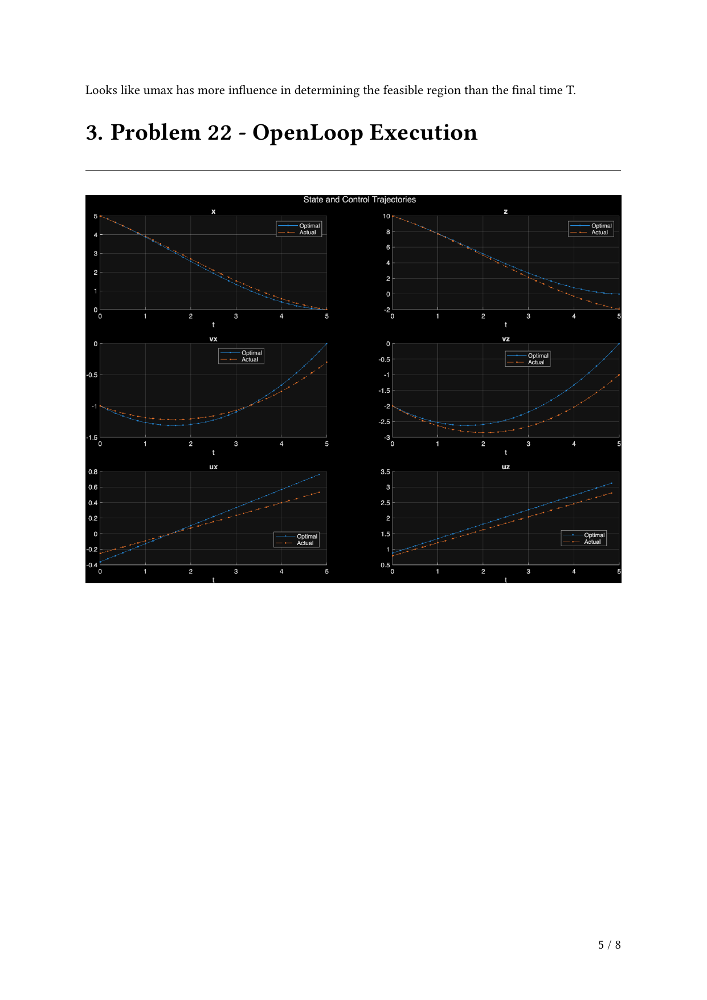
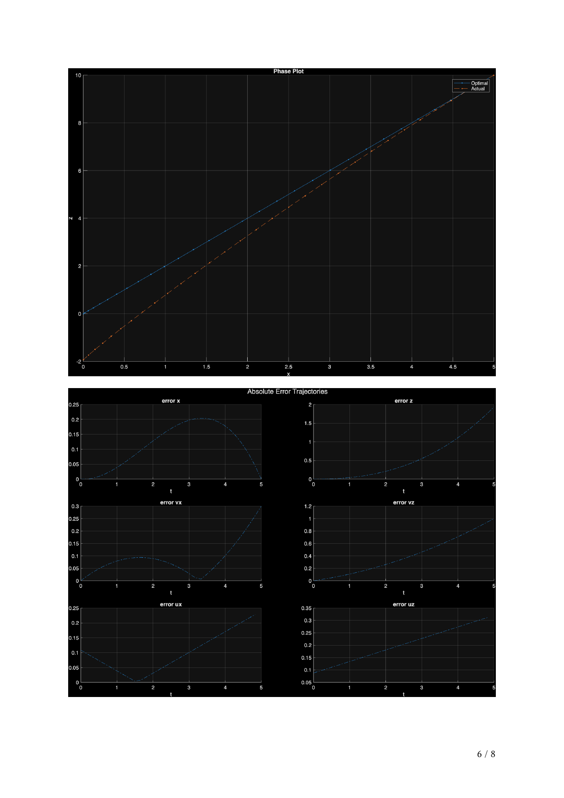
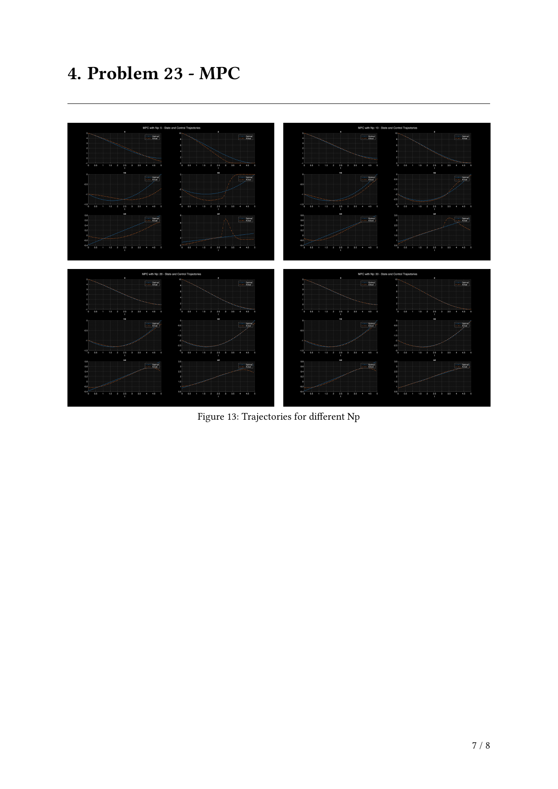
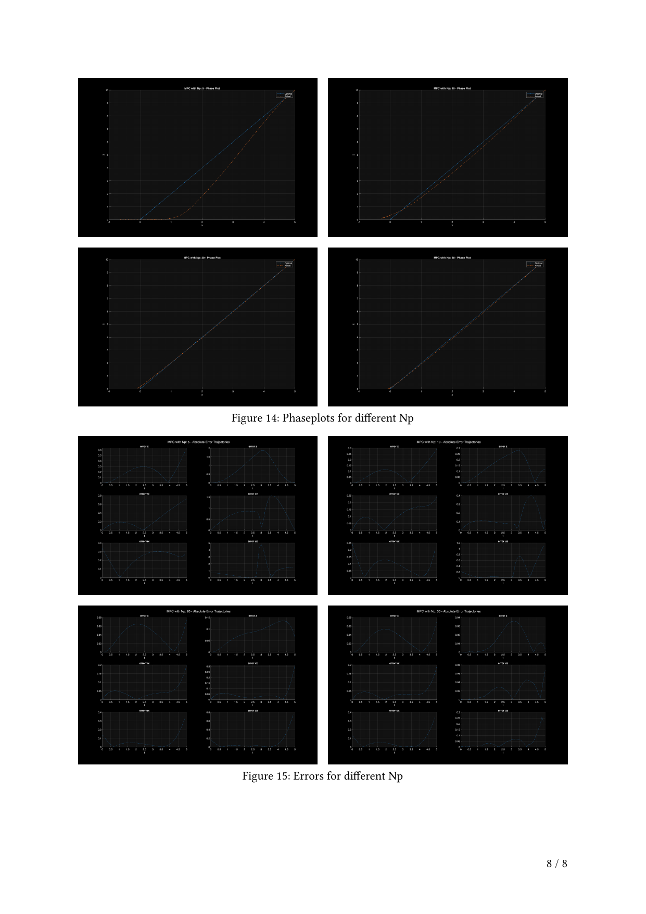

<!-- AUTO-GENERATED by tools/build_readmes.py - edit the report or tools/problems.json, then re-run. -->

# P21-23 - Lander Optimal Control and MPC

2D point-mass lander with thrust limits and a no-go-below-ground constraint: open-loop optimal trajectories, how feasibility collapses as umax and the time horizon shrink, and a model predictive controller that re-solves the problem each step and rejects disturbances.

[&larr; All problems](../README.md) &middot; [Report (PDF)](main.pdf) &middot; [Typst source](main.typ)

## Code

| File | What it does |
| --- | --- |
| [`constraintsFunction.m`](constraintsFunction.m) | `[c, ceq] = constraintsFunction(zfmin, problem)` |
| [`costFunction.m`](costFunction.m) | `cost = costFunction(zfmin, problem)` |
| [`main.m`](main.m) | **Entry point.** Sets up the lander problem, solves the open-loop optimal trajectory, then runs the MPC study. |
| [`MPCConstraintsFunction.m`](MPCConstraintsFunction.m) | `[c, ceq] = MPCConstraintsFunction(zmpc, p, initial_state)` |
| [`MPCCostFunction.m`](MPCCostFunction.m) | `cost = MPCCostFunction(zmpc, zfmin_opt, p, k)` |
| [`openLoopExec.m`](openLoopExec.m) | `openLoopExec(zfmin_opt, p)` |
| [`plot_zfmin.m`](plot_zfmin.m) | `plot_zfmin(zfmin, problem)` |
| [`rhs.m`](rhs.m) | `zalldot = rhs(t, zall, u, p)` |
| [`test.m`](test.m) | Scratch script for poking at the solver. |
| [`touchGroundEvent.m`](touchGroundEvent.m) | `[value,isterminal,direction] = touchGroundEvent(t, zall)` |
| [`unpack_p.m`](unpack_p.m) | `[g, zinit, zfinal, numPoints, tspan] = unpack_p(p)` |
| [`unpack_z.m`](unpack_z.m) | `[x, z, vx, vz] = unpack_z(zall)` |
| [`unpack_zfmin.m`](unpack_zfmin.m) | `[x, z, vx, vz, ux, uz] = unpack_zfmin(zfmin, problem)` |
| [`unpack_zmpc.m`](unpack_zmpc.m) | `[x, z, vx, vz, ux, uz] = unpack_zmpc(zmpc, problem)` |

## Report

