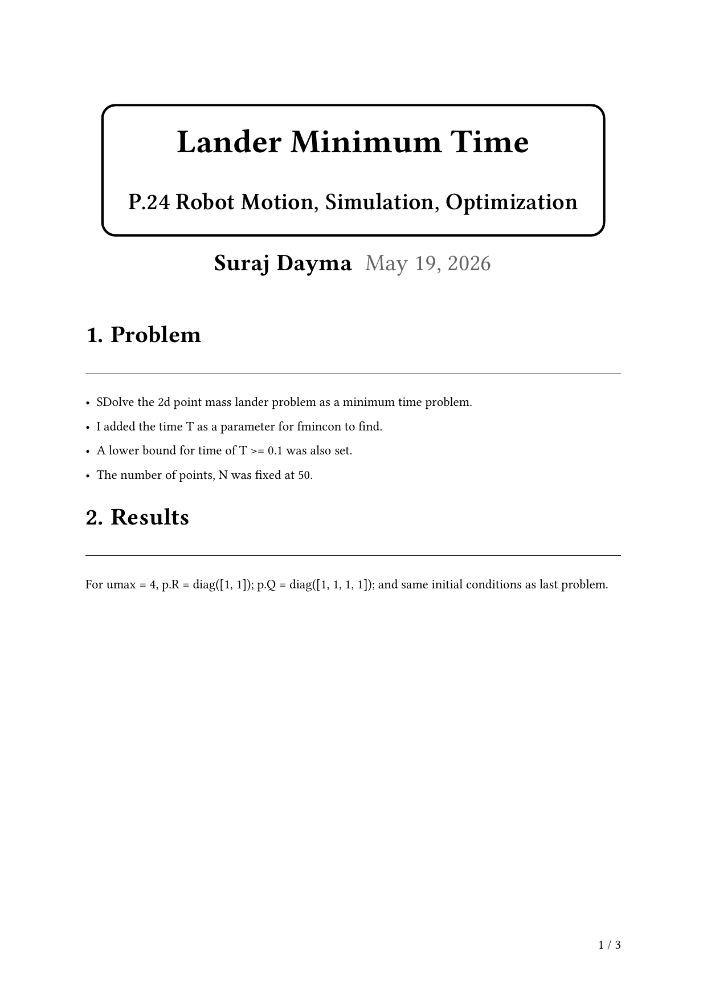
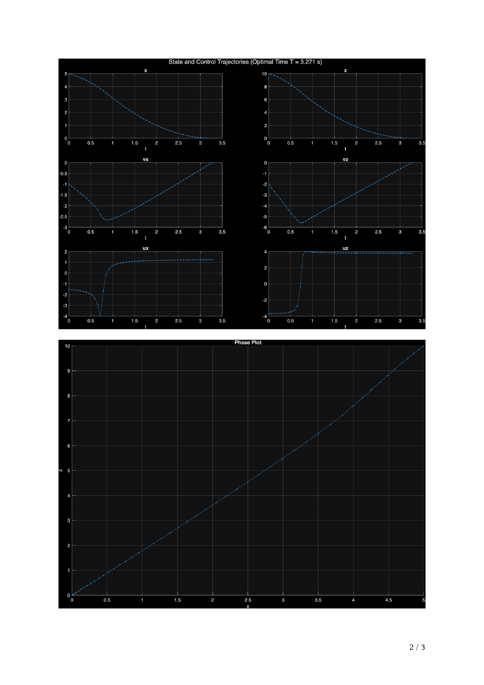
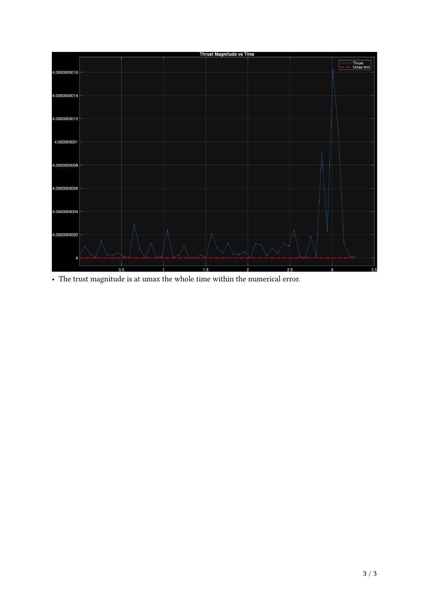

<!-- AUTO-GENERATED by tools/build_readmes.py - edit the report or tools/problems.json, then re-run. -->

# P24 - Lander Minimum Time

The same lander, re-posed as a minimum-time problem with the final time as a free optimisation variable - which drives the thrust to the bang-bang solution.

[&larr; All problems](../README.md) &middot; [Report (PDF)](main.pdf) &middot; [Typst source](main.typ)

## Code

| File | What it does |
| --- | --- |
| [`constraintsFunction.m`](constraintsFunction.m) | `[c, ceq] = constraintsFunction(zfmin, problem)` |
| [`costFunction.m`](costFunction.m) | `cost = costFunction(zfmin, problem)` |
| [`main.m`](main.m) | **Entry point.** Minimum-time lander: final time enters the decision vector and fmincon drives it down. |
| [`plot_zfmin.m`](plot_zfmin.m) | `plot_zfmin(zfmin, problem)` |
| [`rhs.m`](rhs.m) | `zalldot = rhs(t, zall, u, p)` |
| [`touchGroundEvent.m`](touchGroundEvent.m) | `[value,isterminal,direction] = touchGroundEvent(t, zall)` |
| [`unpack_p.m`](unpack_p.m) | `[g, zinit, zfinal, numPoints] = unpack_p(p)` |
| [`unpack_z.m`](unpack_z.m) | `[x, z, vx, vz] = unpack_z(zall)` |
| [`unpack_zfmin.m`](unpack_zfmin.m) | `[x, z, vx, vz, ux, uz, T] = unpack_zfmin(zfmin, problem)` |

## Report

